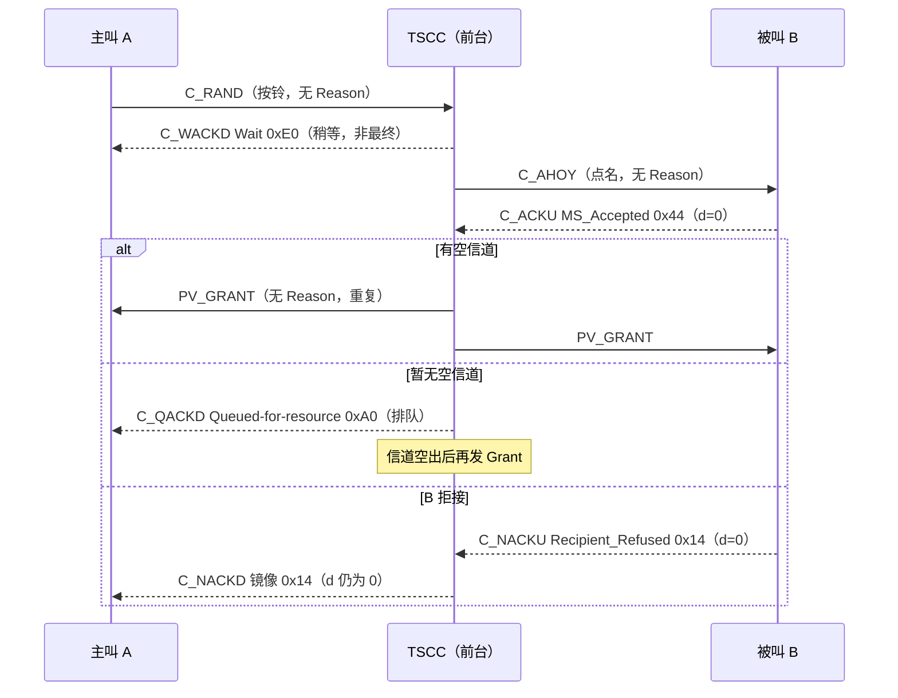

# 第 34 课 · Reason Code 怎么读

> DMR 深入学习 · **阶段 E · 集群 Tier III 第 4 课（约 10 课之四）**（接第 33 课「Grant 变体地图」）  
> 适合：已经会画「守 TSCC →（登记）→ C_RAND → Grant → 进 Payload」总图、也会认 PV/TV/PD 等 Grant 票样，但现场一遇到「**呼不出去 / 一直排队 / 登记不上**」就只会说「被拒了」——说不出**谁拒的、为什么拒、是最终结论还是让你等**——的人  
> 阅读量：约 **30–40 分钟** · **少公式、不贴矩阵、不画完整 SDL** · 要把「**看见拒绝/排队，先找确认族 CSBK（C_ACKD / C_ACKU / P_ACKD / P_ACKU）→ 把 8 bit Reason 拆成 tt / d / aaaaa → 先问最终还是中间 → 再问网络拒还是对方拒 → 最后对表查名字，并顺手读 Response_Info**」钉牢  
> **频谱 / 调制提醒（一小段，不是本课主线）**：RF 仍是 **12.5 kHz**；调制仍是 **4FSK**；空口仍是 **2-slot TDMA**，时隙 **30 ms**。**拒绝理由是控制面里的 8 个比特，不是射频指标**——看见 `SYSbusy_Refused` 却去查驻波、看见 `MSaway_Refused` 却去换天线、看见 `Wait` 却以为「调制解不出来」，都是把账记错了本。频率/带宽/调制四句话见 `学习推送/加餐_频率带宽与调制解调.md`；本课主线是 **阶段 E 第 4 站：读懂前台的「回条」**。

---

## 1. 为什么本课重要（动机）

第 33 课结尾有一句话：**成功路径是 Grant（无 Reason）；失败路径才是 NACK Reason。** 今天就把「失败路径」和「等一等路径」摊开。

现场你一定遇到过这些对话：

- 调度：「他按了 PTT，嘟一声就没了。」——你打开监听，看见一条 **C_ACKD**。同事说：「ACK？那不是成功了吗？」——其实 **C_ACKD 这个名字下装着 ACK / NACK / QACK / WACK 四种回条**，要看 Reason 的头两位才知道是哪种。  
- 用户：「手台一直显示『排队中』。」——你看见 `0xA0`，有人说「A0 是错误码」，其实它是 **QACK · Queued-for-resource**：不是拒绝，是「你排上队了，等信道空出来再发 Grant」。  
- 新站开通当天：「一半手台登记不上。」——你看见 `0x2A` 和 `0x2B` 混着出现。一个是 **Reg_Refused（可以换站再试）**，一个是 **Reg_Denied（被这个 TSCC 赶走、记进拒绝名单）**，处理方式完全不同。  
- 个呼：「对方明明开着机，系统说不在。」——是 `0x24 NoregMSaway_Refused`（**对方没登记**）还是 `0x25 MSaway_Refused`（**对方登记了，但无线检查没回**）？前者查对方登记，后者查对方覆盖/电池/是否在别的业务里。  
- 双工个呼：「双工打不通，半双工能通。」——是网络说 `0x31 Duplex_Congestion`（双工资源不够），还是对方手台说 `0x16 MS_Duplex_Not_Supported`（它根本不支持全双工）？第 33 课讲的 **PV_GRANT_DX**，这里拿到了反面。  
- 分析仪原始字节「2A 4E」——新人直接把 `0x2A` 念成 Reg_Refused，结果真正的 Reason 是 `0x27 SYSbusy_Refused`。**Reason 跨了两个字节**，这是本课最阴的坑（§3.3）。

培训台若只背「NACK = 被拒」，后面会一直卡在同一处：

> **看见回条 ≠ 知道结论。** 读 Reason = 先认 **载体**（CSBKO 32/33/34/35，确认族；Grant/Aloha/Ahoy/RAND 都**不带** Reason）→ 再把 8 bit 拆成 **tt（哪类回条）/ d（谁的意见）/ aaaaa（具体原因）** → 先判 **最终（ACK/NACK）还是中间（QACK/WACK）** → 再判 **网络（TS）拒还是对方手台（MS）拒、是不是 Mirrored_Reason 转述** → 再对表查名字 → 最后按 Reason 读 **Response_Info**（7 bit，含义跟着 Reason 变）。

本课目标：能画出「C_RAND → 回条（ACK/NACK/QACK/WACK）→（成功）Grant」总图；会背确认族载体与字段顺序；会把任意一个 Reason 十六进制值**心算**拆成 tt/d/aaaaa；会用「首位十六进制」速判类别；会分桶记忆常见 NACK（权限 / 对方状态 / 系统资源 / 登记 / 双工 / 其它）；会认 Mirrored_Reason；会按 Reason 读 Response_Info；会把这些和现场控制器设置（排队、碰撞拒绝、防刷）对上号；并为第 35 课「鉴权挑战响应」留好边界。

**本课硬禁令（写进脑子）**：不 dump FEC/CRC、不贴完整 SDL/MSC、不发明 ETSI 条款号（入口锚点以资料库 `04-集群协议/ReasonCode与Grant变体.md` **§0–§9**、`集群协议字段速览.md` **§7–§8**、`总索引.md` **集群 / Tier III** 已有编号为准）、**不回头把第 33 课 Grant 变体再 dump 一遍**（只回唤「Grant 无 Reason」）、**不讲鉴权算法/RC4**（第 35 课；本课只认 `0x48 / 0x64 Authentication Response` 这两个名字）、**不讲 CHAN 绝对频率公式**（第 36）、**不讲 Hunt/拨号/Stun 状态机**（第 37–39；本课只认 Stun 相关拒因名字）、**不重 dump 第 32 课登记 MSC 与 Aloha 字段**。本课只钉 **Reason Code 读法**。

---

## 2. 总图 / 故事：「前台的回条」

### 2.1 一句话故事：按铃之后，前台只会给你四种回条之一

继续第 31–33 课的旅馆：**前台（TSCC）发房间小票（Grant）；客房（Payload）才说话；没办入住（登记）别想要房。**

你在前台按铃（**C_RAND**）要房间之后，前台的反应只有这几种：

1. **直接给小票（Grant）**——成功，什么理由都不用写。第 33 课的内容。  
2. **「好的，收到」条（ACK）**——这是**最终**的肯定回答，常见于登记成功、短消息已接收、状态轮询已接收；条子上写着「为什么好」（如 `Reg_Accepted`）。  
3. **「不行」条（NACK）**——**最终**否定，条子上**必须**写理由：你没权限？对方不在？系统太忙？你没登记？……  
4. **「排队」条（QACK）**——**不是最终**：「收下了，现在没空房/对方占线，排上了，后面还有信令（多半是一张 Grant）。」  
5. **「请稍等」条（WACK）**——**不是最终**：「收下了，正在办，后面还有信令。」登记、呼叫建立中常见。

再加两条细节：

6. **有些「不行」不是前台的意见，而是被叫客人的意见**——比如被叫手台说「我拒接」「我不支持」。前台把客人的原话**原样转述**给你，这叫 **Mirrored_Reason（镜像理由）**；条子上的方向位 `d` 保持 `0`（MS 的意见），你一眼能看出「不是系统拒的，是对方拒的」。  
7. **条子的角落还有一小栏备注（Response_Info，7 bit）**——写什么取决于理由：登记成功时写「省电偏移」；组附着时写「哪几个组收下了」；其它大多数情况写「个号/组号标志 + 一个站点校验码」。

口诀：**先看是不是回条（CSBKO 32/33/34/35）→ 拆 8 位（tt·d·aaaaa）→ 先问「完没完」（最终/中间）→ 再问「谁说的」（网/对方/转述）→ 再查名字 → 最后读角落备注。**

### 2.2 总图：一次请求的所有可能出口

```text
  时间 →

  ┌─ 守 TSCC（第 31–32 课）：已读 Aloha，必要时已登记 ───────┐
  └──────────────────────┬──────────────────────────────────┘
                         ▼
  ┌─ MS → TS：C_RAND（CSBKO 31，按铃）── 无 Reason ─────────┐
  │  Service_Kind / Service_Options = 我要办什么              │
  └──────────────────────┬──────────────────────────────────┘
                         ▼
        （可选）TS → 被叫：C_AHOY（CSBKO 28，点名）── 无 Reason
                 被叫 → TS：C_ACKU / C_NACKU（CSBKO 33）── 有 Reason（d=0）
                         ▼
  ┌─ TS → 主叫：确认族 C_ACKD（CSBKO 32）── 有 Reason ──────┐
  │   tt=11 WACK  "稍等"  ───┐  非最终：后面还有信令          │
  │   tt=10 QACK  "排队"  ───┤                                │
  │   tt=01 ACK   "好了"  ───┼─ 最终（登记/短数据/状态等）     │
  │   tt=00 NACK  "不行"  ───┴─ 最终（附理由；呼叫到此结束）   │
  └──────────────────────┬──────────────────────────────────┘
                         ▼（语音/数据呼叫成功）
  ┌─ TS → 主被叫：Grant 族（CSBKO 48–56）── 无 Reason ──────┐
  │   第 33 课：常重复发；不要求确认                           │
  └──────────────────────┬──────────────────────────────────┘
                         ▼
  ┌─ Payload（客房）：P_ACKD / P_ACKU（CSBKO 34/35）────────┐
  │   结构同 TSCC 确认族；Reason 表完全相同                    │
  └─────────────────────────────────────────────────────────┘
```

同一件事用时序图再看一遍（主叫 A、TSCC、被叫 B）：



### 2.3 和第 25 / 30 / 31 / 32 / 33 课怎么咬合？

| 课 | 你已经会 / 本课加上 |
|----|---------------------|
| 第 25 / 30 | Tier II 个呼的 `UU_V_Req → UU_Ans_Rsp / NACK_Rsp`（CSBKO `100110`=38，**Part2**）——本课的 Tier III 拒绝**不是**它，是 Part4 的 C_NACKD（CSBKO 32） |
| 第 31 | TSCC vs Payload——确认族在 TSCC 是 C_，在 Payload 是 P_（结构相同） |
| 第 32 | 登记 + Aloha——登记成功/失败的「结论」就落在本课的 `0x62 / 0x65 / 0xE0 / 0x2A / 0x2B / 0x2D` |
| 第 33 | Grant 变体——**成功路径**；本课是失败/中间路径；DX 双工的反面理由 `0x31 / 0x16` 在这里 |
| **本课** | **Reason Code 读法 = 阶段 E 第 4 站** |
| 第 35（预告） | 鉴权挑战响应——本课只认名字 `0x48 / 0x64`，不讲算法 |

四句话串起来：

1. **第 32 课**：没登记先别要房；登记的结论在 ACK/NACK 里。  
2. **第 33 课**：成功就是一张 Grant 小票，**票上没有理由栏**。  
3. **本课**：不成功、或者还没成功，前台给的是**回条**；理由就在回条的 8 个比特里。  
4. **射频账本不变**：仍是 12.5 kHz / 4FSK / 双时隙——Reason 是**业务结论**，不是信号质量。

### 2.4 调制账本钩子（巩固弱项，不重开加餐）

1. **带宽**：回条和 Grant 一样走在 **12.5 kHz** 的 TSCC 上（或 Payload 上的 P_ACK）；没有「拒绝专用频率」。  
2. **多址**：仍是 **2-slot TDMA**、时隙 **30 ms**；一条确认 CSBK 就是一个突发里的 96 bit 块（第 15–24 课的外壳）。  
3. **调制**：仍是 **4FSK ≈ 4800 baud ≈ 9.6 kbps** 毛速率——ACK 和 NACK 只差几位比特，**调制完全一样**。  
4. **解调直觉**：**能读出 Reason，就说明解调没问题。** 解调真坏了，你看到的是 CRC 错/解不出 CSBK，而不是一条干干净净的 `SYSbusy_Refused`。所以：**看到清晰的拒因 → 去查业务/配置/容量/对方状态；看不到任何回条 → 才回头查射频与覆盖。**  
细节回 `学习推送/加餐_频率带宽与调制解调.md`。

---

## 3. 载体：Reason 住在哪几种 CSBK 里

Canonical：`ReasonCode与Grant变体.md` **§5**；速览 **§7 / §8**。

### 3.1 只有「确认族」带 Reason

| CSBKO（十进制 / 二进制） | 别名 | 方向 · 信道 | 能装哪几类回条 |
|--------------------------|------|-------------|----------------|
| **32** / `100000` | **C_ACKD**（统称；按 tt 又叫 C_NACKD / C_QACKD / C_WACKD） | TS → MS · TSCC | ACK / NACK / QACK / WACK |
| **33** / `100001` | **C_ACKU**（又叫 C_NACKU） | MS → TS · TSCC | 只有 ACK / NACK（入站没有排队/稍等） |
| **34** / `100010` | **P_ACKD**（P_NACKD） | TS → MS · Payload | 同 C_ACKD 结构 |
| **35** / `100011` | **P_ACKU**（P_NACKU） | MS → TS · Payload | 同 C_ACKU 结构 |

**不带 Reason 的「邻居」**（看见它们别去找理由栏）：

| PDU | CSBKO | 为什么没有 Reason |
|-----|-------|-------------------|
| C_ALOHA | 25 | 是告示牌（第 32 课）；Reg=1 的后果在后续 NACK `0x2D` 里 |
| C_AHOY | 28 | 是点名；「查什么」写在 Service_Kind；回答在被叫的 C_ACKU 里 |
| C_RAND | 31 | 是按铃；理由是前台给的，不是你自己写的 |
| C_ACKVIT | 30 | 鉴权挑战路径（第 35 课）；答案在随后 C_ACKU `0x48` |
| Grant 族 | 48–56 | 成功小票（第 33 课）；**成功不靠 Reason 表达** |
| C_BCAST | 40 | 公告；用 Announcement_type，不是 Reason |

**一句话**：同一个 CSBKO 32 装四种回条，**区分它们的不是 Opcode，而是 Reason 的头两位 tt**。这点和第 33 课相反——Grant 是「Opcode 定票样」，回条是「Reason 头两位定类别」。

### 3.2 字段顺序（C_ACKD，64 bit 信息部分）

```text
  Octet 0 : LB(1)=1 | PF(1) | CSBKO(6)=100000
  Octet 1 : FID(8)=0000 0000
  ── 以下 64 bit ──────────────────────────────────────
  Response_Info (7)      ← 角落备注，含义随 Reason 变（§9）
  Reason Code   (8)      ← 本课主角：tt(2) d(1) aaaaa(5)
  Reserved      (1)=0
  Target address (24)    ← 当初发请求的那台 MS
  Additional Info / Source (24) ← 请求的目的（被叫/组/网关）
```

C_ACKU（33）结构相同，只是 Target 位置在鉴权时装 24 bit 挑战响应（第 35 课），Source 是**发这条确认的 MS 自己**。

开源解码器 DMRDecode 的注释写的也是这套顺序：从 CSBK 第 0 位起数（Octet 0–1 占第 0–15 位），第 16–22 位是 Response_Info，第 23–30 位是 Reason Code，第 31 位保留，然后两个 24 位地址——和库内整理一致（见 §18 外链）。

### 3.3 最阴的坑：Reason 跨了两个字节

7 + 8 + 1 = 16 bit，刚好占 Octet 2 和 Octet 3 两个字节，但**分界不在字节边界上**：

```text
            Octet 2                    Octet 3
   ┌───────────────────────┬──┐ ┌──────────────────────┬──┐
   │ Response_Info (7 bit) │R7│ │ Reason bit6 … bit0    │Rs│
   └───────────────────────┴──┘ └──────────────────────┴──┘
                            ▲                            ▲
                     Reason 最高位                     Reserved=0
```

所以 **Reason = (Octet2 的最低位 × 128) + (Octet3 ÷ 2，取整)**。写成位运算就是 `Reason = ((Oct2 & 0x01) << 7) | (Oct3 >> 1)`。

**例 A**：原始字节 `Oct2 = 0x2A`，`Oct3 = 0x4E`。

- 新人直接念：「0x2A，Reg_Refused！」——错。  
- 正确：`Oct2 & 1 = 0`；`0x4E >> 1 = 0x27`；Reason = **`0x27` = `0010 0111₂` = SYSbusy_Refused（网络过载）**。  
- 顺手：`Oct2 >> 1 = 0x15 = 001 0101₂` 是 Response_Info → G/I=`0`（个号）、Response_Check=`010101₂`。

**例 B**：原始字节 `Oct2 = 0x0B`，`Oct3 = 0xC0`。

- 只看 `Oct3 >> 1 = 0x60`，会念成「Message_Accepted，成功！」——错。  
- 正确：`Oct2 & 1 = 1` → 最高位是 1；Reason = `0x80 | 0x60` = **`0xE0` = WACK Wait（稍等，非最终）**。  
- **丢掉一个最高位，WACK 就变成了 ACK**——现场判断「到底成功没有」完全反了。

> 好消息：你手里的分析仪/解码软件大多已经帮你拼好了 Reason。这一节是为了**当软件显示可疑、或你只拿到十六进制原始字节时**，你能自己核一遍。

---

## 4. 8 bit 拆法：tt · d · aaaaa

Canonical：`ReasonCode与Grant变体.md` **§1**（clause 7.2.8.0，表 7.42–7.45）。

### 4.1 骨架

```text
   bit7 bit6 │ bit5 │ bit4 bit3 bit2 bit1 bit0
     t    t  │  d   │  a    a    a    a    a
   ──────────┼──────┼─────────────────────────
   回条类别  │ 谁的意见 │      具体原因（5 bit，最多 32 种）
```

| 场 | 位数 | 编码 | 白话 |
|----|------|------|------|
| **tt** | 2 | `00` NACK · `01` ACK · `10` QACK · `11` WACK | 这张条子是「不行 / 好了 / 排队 / 稍等」 |
| **d** | 1 | `1` = TS → MS（**网络的意见**）· `0` = MS → TS（**手台的意见**，或网络原样转述手台的意见） | 谁说的 |
| **aaaaa** | 5 | 查表 | 为什么 |

**规范要点**：QACK / WACK 只有 TS → MS（`d=1`）；入站 C_ACKU 只有 ACK / NACK。

### 4.2 「首位十六进制」速判（本课最实用的一张表）

因为 tt 占最高两位、d 占第三位，**Reason 的第一个十六进制数字就已经告诉你类别和方向**：

| 首位 hex | 二进制前三位 | tt | d | 白话 | 常见值 |
|----------|--------------|----|---|------|--------|
| **0x0_ / 0x1_** | `000` | NACK | 0 | **手台（对方）拒绝** | 0x00, 0x14, 0x16 |
| **0x2_ / 0x3_** | `001` | NACK | 1 | **网络拒绝** | 0x27, 0x2A, 0x2D, 0x31 |
| **0x4_ / 0x5_** | `010` | ACK | 0 | **手台接受**（或网络转述） | 0x44, 0x46 |
| **0x6_ / 0x7_** | `011` | ACK | 1 | **网络接受** | 0x60, 0x62, 0x65 |
| 0x8_ / 0x9_ | `100` | QACK | 0 | （规范未用：入站无排队） | — |
| **0xA_ / 0xB_** | `101` | QACK | 1 | **网络：排队中** | 0xA0, 0xA1 |
| 0xC_ / 0xD_ | `110` | WACK | 0 | （规范未用） | — |
| **0xE_ / 0xF_** | `111` | WACK | 1 | **网络：请稍等** | 0xE0 |

口诀：**「零一对方拒，二三网络拒；四五对方收，六七网络收；A B 排队，E F 稍等。」**

看见 `0x8_ / 0x9_ / 0xC_ / 0xD_`：先怀疑**拼字节拼错了**（§3.3），或者是厂商私有 FID 下的东西，而不是标准 Reason。

### 4.3 手算三遍（拆给你看）

| Reason | 二进制 | tt | d | aaaaa | 查表结果 |
|--------|--------|----|---|-------|----------|
| `0x27` | `00 1 00111` | 00 NACK | 1 网络 | 00111 | **SYSbusy_Refused**：网络过载 |
| `0x14` | `00 0 10100` | 00 NACK | 0 手台 | 10100 | **Recipient_Refused**：被叫用户拒接 |
| `0xA0` | `10 1 00000` | 10 QACK | 1 网络 | 00000 | **Queued-for-resource**：排队等资源 |
| `0x62` | `01 1 00010` | 01 ACK | 1 网络 | 00010 | **Reg_Accepted**：登记成功 |
| `0xE0` | `11 1 00000` | 11 WACK | 1 网络 | 00000 | **Wait**：稍等，后面还有信令 |
| `0x44` | `01 0 00100` | 01 ACK | 0 手台 | 00100 | **MS_Accepted**：被叫手台接受 |

**注意**：同一个 aaaaa 在不同 tt 下意思完全不同。`aaaaa=00000` 在网络 NACK 里是 `Not_Supported (0x20)`，在网络 ACK 里是 `Message_Accepted (0x60)`，在 QACK 里是 `Queued-for-resource (0xA0)`，在 WACK 里是 `Wait (0xE0)`。**所以永远整 8 位一起查表，别只记后 5 位。**

---

## 5. 先分「最终」还是「中间」

| 类别 | tt | 最终？ | 后面还会发生什么 | 现场一句话 |
|------|----|--------|------------------|------------|
| **ACK** | 01 | ✅ 最终 | 对登记/短数据/状态等，事情就办完了；对呼叫类，可能是把被叫的「接受」转述给主叫（Mirrored），随后才有 Grant | 「办好了」 |
| **NACK** | 00 | ✅ 最终 | **这次请求到此结束**；手台通常提示失败音/失败文字 | 「不行，理由是……」 |
| **QACK** | 10 | ❌ 中间 | 还在系统里排着；后面多半是 Grant，也可能最终以 NACK 收场（看厂商定时器策略） | 「排上了，别重按」 |
| **WACK** | 11 | ❌ 中间 | 还在办；后面是 ACK / NACK / Grant 之一 | 「在办，等一下」 |

两个现场常识：

1. **排队期间反复按 PTT 是坏习惯**。QACK 之后再按，等于再发一次 C_RAND；有的控制器会把频繁重复请求当「刷屏」处理并回 NACK（§12 的 KAIROS 例子里叫 Flooding Filter）。  
2. **主叫想撤回排队中的呼叫**，网络可能回 `0x29 Call_Cancel_Refused`——「已经撤不回了，呼叫可能照样接通」。看到它别惊讶：这不是系统坏了，是撤销来晚了。

---

## 6. ACK：「好了」条（tt=01，表 7.42）

### 6.1 网络说「好了」（d=1，`0x6_`）

| Hex | 名称 | 白话 | 角落备注 Response_Info | 常在哪看见 |
|-----|------|------|------------------------|------------|
| `0x60` | **Message_Accepted** | 网络接受，继续 | G/I + Response_Check | 短数据、改向请求被接受 |
| `0x61` | **Store_Forward** | 被叫**没登记**，网络先存着，等它登记了再投递 | G/I + Response_Check | 发短消息给关机的人 |
| `0x62` | **Reg_Accepted** | **登记成功** | **PowerSave_Offset**（省电偏移） | 开机登记、换站登记 |
| `0x63` | Accepted for Status Polling | 状态轮询接受 | **Status**（状态值） | 调度台查状态 |
| `0x64` | Authentication Response | 网络对鉴权挑战的响应 | — | 第 35 课 |
| `0x65` | **Reg_Subscription/Attachment** | 登记 + 组附着结果 | **Index pattern**（7 个组各 1 位） | 带组列表的登记 |

### 6.2 手台说「好了」（d=0，`0x4_`；网络可原样转述）

| Hex | 名称 | 白话 | 常在哪看见 |
|-----|------|------|------------|
| `0x44` | **MS_Accepted** | 被叫手台接受 | 回应 C_AHOY 点名、无线检查 OK |
| `0x45` | **CallBack** | 被叫说「我稍后回你」 | 个呼被叫选择回呼 |
| `0x46` | **MS_ALERTING** | 被叫在振铃，还没摘机 | 需要被叫应答的个呼（FOACSU 类） |
| `0x47` | Accepted for Status Polling | 手台侧接受状态轮询 | 状态业务 |
| `0x48` | Authentication Response | 手台对鉴权挑战的响应 | 第 35 课 |

**两个「ACK 但不等于成功接通」的提醒**：

- `0x61 Store_Forward`：对你来说是「已收下」，**但对方还没收到**。调度问「他看到没？」——答：「还没，他登记上来才会收到。」  
- `0x45 CallBack` / `0x46 MS_ALERTING`：是「对方态度」，不是「已经通了」。真正通话要等 Grant。

---

## 7. NACK（网络拒）：分桶记，不要硬背（tt=00，d=1，`0x2_ / 0x3_`）

表 7.43 网络侧共 19 行（`0x20`–`0x31` 加 `0x3F`）。按**你接下来该找谁**分成六个桶：

### 7.1 桶①：业务/权限——「你不能办这个」（找写频/开户）

| Hex | 名称 | 白话 | 下一步 |
|-----|------|------|--------|
| `0x20` | **Not_Supported** | 已登记，但**网络不支持**该业务 | 问系统侧：这功能开了吗？买了许可吗？ |
| `0x21` | **Perm_User_Refused** | 该用户**永久**没权限（「永久」由厂商定义） | 查用户权限配置 |
| `0x22` | **Temp_User_Refused** | 该用户**暂时**没权限（例：电话互联中继故障） | 查临时故障/时段限制 |
| `0x2F` | **Called_Group_Not_Allowed** | 这个**组号不被本 TSCC 允许** | 查组在本站是否授权/开通 |

### 7.2 桶②：对方状态——「人找不到/占着」（找被叫）

| Hex | 名称 | 白话 | 下一步 |
|-----|------|------|--------|
| `0x24` | **NoregMSaway_Refused** | 被叫号码合法，但**没登记**（关机、注销） | 让对方开机/查对方登记 |
| `0x25` | **MSaway_Refused** | 被叫**登记了**，但点名（无线检查）**没回** | 对方覆盖边缘？没电？在别的业务？ |
| `0x26` | **Div_Cause_Fail** | 被叫设置了呼叫改向，短数据轮询没法进行 | 查对方改向设置 |
| `0x2E` | **Called_Party_Busy** | 被叫忙，且网络**不愿意排队** | 稍后再呼；或问为何不排队 |

`0x24` 和 `0x25` 是现场最常混的一对：**`24` = 名单上没他；`25` = 名单上有他但叫不应。** 前者查登记，后者查信号。

### 7.3 桶③：系统资源/状态——「前台此刻办不了」（找网管）

| Hex | 名称 | 白话 | 下一步 |
|-----|------|------|--------|
| `0x23` | **Transient_Sys_Refused** | 此刻网络提供不了（也用于「不允许改向到这个目标」） | 稍后重试；看是否某链路故障 |
| `0x27` | **SYSbusy_Refused** | **网络过载** | 看话务量、信道是否不够、是否有信道故障 |
| `0x28` | **SYS_NotReady** | 网络**没就绪**（维护/建设中） | 问是否在维护窗口 |
| `0x2C` | **IP_Connection_failed** | IP 连接通告失败 | 查数据/IP 网关 |
| `0x30` | **CRC_error_in_the_UDT_Upload_phase** | 短数据（UDT）上行 CRC 错，没法继续 | 这是少数**和信号质量有关**的拒因：上行误码 |

> `0x30` 是本课唯一一个「可能真要看射频」的网络拒因：UDT 上行数据块 CRC 不对，说明那几个块没收好。但即便如此，它也是**网络把结论告诉你**，下行回条本身解得很干净。

### 7.4 桶④：登记——「先办入住」（回第 32 课）

| Hex | 名称 | 白话 | 关键区别 |
|-----|------|------|----------|
| `0x2A` | **Reg_Refused** | 登记被**拒绝** | 可以去**别的站**再试（Hunt，第 37 课） |
| `0x2B` | **Reg_Denied** | 登记被**否决** | 把 MS 从**这个 TSCC 赶走**的首选终答；记入 Denied Registration List |
| `0x2D` | **MS_Not_Registered** | 系统要求先登记（Aloha 的 Reg=1），而你没登记就来办业务 | 先登记再按铃 |

记法：**Refused（拒）= 「这次不行，换个门试试」；Denied（否决）= 「这扇门别再来了」。**

### 7.5 桶⑤：双工——第 33 课 DX 的反面

| Hex | 名称 | 白话 | 下一步 |
|-----|------|------|--------|
| `0x31` | **Duplex_Congestion** | **双工资源不够** | 规范允许 MS **改用半双工**再试 |

（手台侧的 `0x16 MS_Duplex_Not_Supported` 见 §8。一个是「网络没双工资源」，一个是「对方手台不会双工」。）

### 7.6 桶⑥：其它

| Hex | 名称 | 白话 |
|-----|------|------|
| `0x29` | **Call_Cancel_Refused** | 主叫在 QACK/WACK 之后想取消，但已经撤不回（呼叫可能仍会接通） |
| `0x3F` | **Refused_Reason_Unknown** | 拒绝，原因未知 |

`0x32`–`0x3E` 表 7.43 没有给出。看见它们：先核字节拼接，再问厂商。

---

## 8. NACK（手台拒）：对方的意见（tt=00，d=0，`0x0_ / 0x1_`）

| Hex | 名称 | 白话 | 常在哪看见 |
|-----|------|------|------------|
| `0x00` | **MSNot_Supported** | 被叫**手台不支持**该业务/特性 | 遥毙/唤醒（Stun/Revive）、环境侦听（ALS）等对方不支持时 |
| `0x11` | LineNot_Supported | 需要线路侧设备但没装 | 电话/线路相关 |
| `0x12` | StackFull_Refused | 被叫内部呼叫栈满，且不是先进先出 | 对方挂着太多待处理呼叫 |
| `0x13` | EquipBusy_Refused | 被叫附属设备忙 | 外接设备场景 |
| `0x14` | **Recipient_Refused** | **被叫用户拒接** | 需要被叫应答的个呼；遥毙/唤醒被拒 |
| `0x15` | Custom_Refused | 厂商自定义拒因（**不用于登记过程**） | 查厂商文档 |
| `0x16` | **MS_Duplex_Not_Supported** | 对方**不支持 MS–MS 全双工** | 双工个呼（第 33 课 DX） |
| `0x1F` | Refused_Reason_Unknown | 手台侧拒绝，原因未知 | — |

**资料库特别标注**：`0x16` 在规范 7.2.8.2 的正文里有，但 **Table 7.43 的表体没列**——库内已按正文补入并标注（`ReasonCode与Grant变体.md` §3.2）。开源 SDRTrunk 的 Reason 枚举里也有 `MS_DUPLEX_NOT_SUPPORTED(0x16)`，可作旁证。

**`0x00` 的陷阱**：Reason = `0x00` 不是「空值/没填」，而是一个正经的拒因 `MSNot_Supported`。别因为它是全零就当成「读错了」。

---

## 9. QACK / WACK 与 Mirrored_Reason

### 9.1 排队与稍等（表 7.44 / 7.45，只有网络发）

| Hex | 类别 | 名称 | 白话 | 后面会怎样 |
|-----|------|------|------|------------|
| `0xA0` | QACK | **Queued-for-resource** | 排队等资源（比如业务信道） | 有空信道时发 Grant |
| `0xA1` | QACK | **Queued-for-busy** | 被叫正在别的呼叫里 | 对方空下来再继续 |
| `0xE0` | WACK | **Wait** | 收下了，在办 | ACK / NACK / Grant 之一 |

`0xA0` 和 `0x2E` 是一对「同一件事、两种处理」：被叫忙时，网络**愿意排队**就回 `0xA1 Queued-for-busy`；**不愿意排队**就直接回 `0x2E Called_Party_Busy`（最终拒绝）。是排还是拒，是**系统策略**，不是手台问题。

> **实现参考的小瑕疵（顺带练眼力）**：开源 SDRTrunk 的 `Reason.java` 里把 Queued-for-busy 写成了 `0xAa`，而库内按 Table 7.44 整理的是 `0xA1`（`1010 0001₂`）。开源代码是很好的旁证，但**冲突时以 ETSI 原文为准**。

### 9.2 Mirrored_Reason：前台原样转述客人的话

规范（7.2.8.0）的意思：被叫手台在 C_ACKU / C_NACKU 里给出的 Reason，网络可以**原样**转发给主叫（放进 C_ACKD / C_NACKD），这叫 **Mirrored_Reason**；**方向位 d 保持手台侧的 `0`**。

```text
  被叫 B ──C_NACKU(Reason=0x14 Recipient_Refused, d=0)──▶ TSCC
  TSCC  ──C_NACKD(Mirrored_Reason=0x14, d 仍=0)────────▶ 主叫 A
         ▲ 载体是网络发的 C_ACKD(CSBKO 32)，但理由是 B 的
```

**现场读法**：

- 载体是 **CSBKO 32（网络发）**，Reason 却是 **`0x0_ / 0x1_ / 0x4_`（d=0）** → 这是**转述**，**拒你的是对方，不是系统**。  
- 载体是 CSBKO 32，Reason 是 `0x2_ / 0x3_`（d=1）→ **系统自己拒的**。

一句话：**CSBKO 告诉你「谁递的条子」，d 位告诉你「条子上是谁的意见」。**

---

## 10. Response_Info：角落备注，跟着 Reason 变（Table 7.41）

Canonical：`ReasonCode与Grant变体.md` **§6**。7 bit，**不能脱离 Reason 单独读**。

| 当 Reason 是 | Response_Info 装的是 | 白话 |
|--------------|----------------------|------|
| `0x62` Reg_Accepted | **PowerSave_Offset**（7 bit） | 登记成功时顺便告诉你「省电醒来的偏移」 |
| `0x63` / `0x47` 状态轮询接受 | **Status**（7 bit） | 状态值本身 |
| `0x65` Reg_Subscription/Attachment | **Index pattern**（7 bit，每位对应一个组） | 你申请附着的 7 个组，哪几个收下了 |
| **其它所有 Reason** | **G/I（1 bit）+ Response_Check（6 bit）** | G/I：`0` 个号/网关，`1` 组；Response_Check：系统码里网号+站号部分的低 6 位（学习口径：让手台核对这条回条出自本系统/本站） |

**Index pattern 读法**（Table 6.10）：最高位对应列表里第 1 个组地址，最低位对应第 7 个。

```text
  Response_Info = 1 1 0 1 0 0 0
                  │ │ │ │ │ │ └ 组7 ✗
                  │ │ │ │ │ └── 组6 ✗
                  │ │ │ │ └──── 组5 ✗
                  │ │ │ └────── 组4 ✓
                  │ │ └──────── 组3 ✗
                  │ └────────── 组2 ✓
                  └──────────── 组1 ✓
```

- `1111111₂` = 全部接受；  
- `0000000₂` = **登记本身可以接受，但这一批组列表全被拒**（6.4.4.1.13）——手台「登记上了却收不到组呼」的经典原因之一。

**常见误读**：把 `0x62` 的 Response_Info 当成「G/I + 校验码」去解——不对，这时它是省电偏移。**先看 Reason，再决定角落备注怎么解。**

---

## 11. 现场分诊表（五步）

| 步 | 问题 | 怎么看 | 看错的典型后果 |
|----|------|--------|----------------|
| ① | 这是不是回条？ | CSBKO = 32/33（TSCC）或 34/35（Payload），FID=0 | 在 Grant/Aloha/Ahoy 里找理由栏，找不到就说「没原因」 |
| ② | 拼对 8 位了吗？ | 软件已拼好就直接用；只有原始字节时按 §3.3：`(Oct2&1)<<7 \| (Oct3>>1)` | `2A 4E` 念成 Reg_Refused（其实是 SYSbusy） |
| ③ | 完了没？ | tt：`01/00` 最终；`10/11` 中间 | 把 QACK 当失败，让用户狂按 PTT |
| ④ | 谁的意见？ | d=1 网络；d=0 手台（CSBKO 32 + d=0 = **转述**） | 把被叫拒接报成「系统故障」 |
| ⑤ | 具体为什么、角落写了啥？ | 查 §6–§9；按 Reason 读 Response_Info（§10） | 把省电偏移当校验码 |

**按「下一步找谁」再归一次**：

| 首位 / 值 | 找谁 |
|-----------|------|
| `0x20 0x21 0x22 0x2F` | 写频/开户/权限配置 |
| `0x24 0x25 0x26 0x2E` + 手台侧 `0x0_ 0x1_` | 被叫本人 / 被叫终端 |
| `0x23 0x27 0x28 0x2C 0x31` | 网管 / 容量 / 链路 |
| `0x2A 0x2B 0x2D` | 登记与站点配置（第 32 课） |
| `0x30` | 上行信号质量（少数真要看射频的） |
| `0xA_ 0xE_` | 谁都别找——**等** |

---

## 12. 现场对照：控制器设置怎么变成 Reason

协议规定的是「回条长什么样」；**什么时候回哪种条**，很多是控制器（TSC）的配置。拿一份公开的厂商应用说明——JVCKENWOOD《DMR Tier III · KAIROS Tier III Trunking》（AN-19-0001，见 §18）——里的几项控制器设置来对照（以下为对该文档设置说明的学习向转述，具体行为以厂商为准）：

| 控制器设置（英文原名） | 文档里的意思（转述） | 你在空口上可能看到 |
|------------------------|----------------------|--------------------|
| **Timeout Audio Call Setup QACK** | 收到呼叫请求后，系统最多等多久（没收到应答）就把呼叫转入排队 | 等待超时后出现 **QACK**（排队） |
| **Audio Call Group Mode · All Start** | 多站组呼：只要有一个目的站没空信道，就整体排队，等所有站都有信道才建立 | 一段时间的 **QACK `0xA0`**，然后才 Grant |
| **Audio Call Group Mode · Fast Start** | 有信道的站先建立，忙的站有信道后再加入 | 先 Grant；晚到的站靠迟后进入（第 33 课 Late_Entry） |
| **Talkgroup Call Collision · Deny** | 两台手台几乎同时发起同一组呼，晚一点的那台收到 NACK，再靠迟后进入进入业务信道 | 一条 **NACK**，随后靠迟后进入（可能看到 Late_Entry=1 的 TV_GRANT） |
| **Talkgroup Call Collision · Wait Late Entry** | 同样碰撞，但 TSCC 不给晚到者回 NACK，让它直接靠迟后进入 | 没有 NACK，只有 Late_Entry Grant |
| **Flooding Filter** | 同一呼叫过于频繁时，控制「回 NACK」的力度 | 用户狂按 PTT 后出现 **NACK** |

**这张表想让你记住的一件事**：同一个现场现象，「回 NACK 还是排队」「碰撞时给不给 NACK」，可以是**配置选择**。所以看见 NACK，别第一时间说「协议有问题」——先问：**控制器是怎么配的？**

（该文档没有逐条写出每种情况用哪个 Reason 值，所以上表「可能看到」只写到类别；具体值以现场抓包为准，**不要**替厂商补数字。）

### 12.1 工作例子（10 则）

**例 1 · 嘟一声就没了。** 抓到 `C_ACKD`，Reason `0x2F`。→ 首位 2 = 网络拒；`0x2F` = Called_Group_Not_Allowed。→ 这个组在本站没授权，找配置，不找射频。

**例 2 · 一直「排队中」。** Reason `0xA0`。→ 首位 A = 排队；Queued-for-resource。→ 业务信道不够或多站组呼在等（All Start）。告诉用户**别重按**；网管看话务高峰。

**例 3 · 新站一半手台登记不上。** 一部分 `0x2A`，一部分 `0x2B`。→ `2A` 可换站重试，`2B` 被本站否决、进拒绝名单。→ 重点查 `2B` 的那批：号段/授权是否没开到本站。

**例 4 · 对方开着机却「不在」。** Reason `0x25`。→ MSaway_Refused：**登记了但点名没回**。→ 对方在覆盖边缘？电量低？正在别的业务里？（若是 `0x24` 则查登记。）

**例 5 · 个呼被拒，同事说是系统故障。** 载体 CSBKO 32，Reason `0x14`。→ 首位 1 = d=0 手台意见，是**转述**；Recipient_Refused = 对方拒接。→ 不是系统故障。

**例 6 · 双工打不通、半双工能通。** 看 Reason：`0x31` → 网络双工资源不够（Duplex_Congestion，可改半双工）；`0x16` → 对方手台不支持全双工。→ 前者找网管扩资源，后者是终端能力。

**例 7 · 短消息「发成功了」但对方说没收到。** Reason `0x61` Store_Forward。→ 网络先存着，对方没登记。等对方开机登记后才投递。

**例 8 · 登记成功却收不到某些组呼。** Reason `0x65`，Response_Info `0000000₂`。→ 登记本身接受，但组列表全被拒。→ 查组附着授权（若是 `1101000₂`，则只有第 1、2、4 组被收下）。

**例 9 · 原始字节 `0B C0`。** 拼接：`(0x0B&1)<<7 = 0x80`，`0xC0>>1 = 0x60`，Reason = `0xE0` Wait。→ 中间态，还没完；**不是**「Message_Accepted 已成功」。

**例 10 · 未登记就按铃。** Aloha 的 Reg=1（第 32 课），手台跳过了登记，回条 `0x2D` MS_Not_Registered。→ 先查手台为什么没登记（开机登记被关？登记失败没处理？）。

---

## 13. 术语账本 / 口袋速查

### 13.1 白话术语表

| 术语 | 白话 | 别和谁混 |
|------|------|----------|
| **Reason Code** | 回条上的 8 位理由码 | ≠ Grant 里的任何字段（Grant 没有理由栏） |
| **tt（ACK type）** | 回条类别：NACK/ACK/QACK/WACK | ≠ CSBKO（四类共用 CSBKO 32） |
| **d（direction）** | 理由是谁的意见：1 网络，0 手台 | ≠ 这条 CSBK 本身的发送方向 |
| **aaaaa** | 5 位具体原因 | 同样的 aaaaa 在不同 tt 下意思不同 |
| **C_ACKD / C_NACKD / C_QACKD / C_WACKD** | 网络在 TSCC 上发的回条（同一 CSBKO 32） | ≠ Part2 的 NACK_Rsp（CSBKO 38，第 25 课） |
| **C_ACKU / C_NACKU** | 手台在 TSCC 上发的回条（CSBKO 33） | 入站没有排队/稍等 |
| **P_ACKD / P_ACKU** | 业务信道上的回条（34/35） | 结构与 Reason 表同 TSCC |
| **最终 / 中间** | ACK·NACK 是结论；QACK·WACK 是「还在办」 | 别把排队当失败 |
| **Mirrored_Reason** | 网络原样转述手台的理由，d 保持 0 | ≠ 系统拒绝 |
| **Response_Info** | 7 位角落备注，含义随 Reason 变 | 别脱离 Reason 单独解 |
| **Response_Check** | 6 位站点校验（系统码网号+站号部分的低 6 位） | ≠ CRC |
| **Index pattern** | 组附着结果，每位一个组 | `0000000` ≠ 登记失败 |
| **Refused vs Denied** | 拒绝（换站可试）vs 否决（别来本站） | `0x2A` vs `0x2B` |
| **Store_Forward** | 先存后投 | ≠ 对方已收到 |

### 13.2 口袋速查：最常用的 20 个值

| Hex | 名称 | 类别 · 谁 |
|-----|------|-----------|
| `0x00` | MSNot_Supported | NACK · 手台 |
| `0x14` | Recipient_Refused | NACK · 手台 |
| `0x16` | MS_Duplex_Not_Supported | NACK · 手台 |
| `0x20` | Not_Supported | NACK · 网络 |
| `0x21` | Perm_User_Refused | NACK · 网络 |
| `0x23` | Transient_Sys_Refused | NACK · 网络 |
| `0x24` | NoregMSaway_Refused | NACK · 网络 |
| `0x25` | MSaway_Refused | NACK · 网络 |
| `0x27` | SYSbusy_Refused | NACK · 网络 |
| `0x2A` | Reg_Refused | NACK · 网络 |
| `0x2B` | Reg_Denied | NACK · 网络 |
| `0x2D` | MS_Not_Registered | NACK · 网络 |
| `0x2E` | Called_Party_Busy | NACK · 网络 |
| `0x2F` | Called_Group_Not_Allowed | NACK · 网络 |
| `0x31` | Duplex_Congestion | NACK · 网络 |
| `0x44` | MS_Accepted | ACK · 手台 |
| `0x60` | Message_Accepted | ACK · 网络 |
| `0x62` | Reg_Accepted | ACK · 网络 |
| `0xA0` | Queued-for-resource | QACK · 网络 |
| `0xE0` | Wait | WACK · 网络 |

### 13.3 数字与符号账本

| 数字 | 含义 |
|------|------|
| **32 / 33 / 34 / 35** | C_ACKD / C_ACKU / P_ACKD / P_ACKU 的 CSBKO |
| **7 + 8 + 1** | Response_Info + Reason + Reserved，横跨 Octet 2–3 |
| **2 + 1 + 5** | tt + d + aaaaa |
| **38** | Part2 的 NACK_Rsp（Tier II 个呼），**不是** Tier III C_NACKD |
| **7.42 / 7.43 / 7.44 / 7.45** | ACK / NACK / QACK / WACK 表号 |
| **7.41** | Response_Info 表号 |

---

## 14. 十则误区（看见就打回）

1. 「C_ACKD 就是成功。」——**错**。CSBKO 32 装四类回条，要看 tt。  
2. 「在 Grant 里找拒绝原因。」——**错**。Grant 没有 Reason；拒绝在确认族。  
3. 「QACK 是失败。」——**错**。排队是中间态，后面多半是 Grant。  
4. 「只记后 5 位就行。」——**错**。`00000` 在四类里分别是 Not_Supported / Message_Accepted / Queued / Wait。  
5. 「Octet 3 就是 Reason。」——**错**。Reason 跨字节，最高位在 Octet 2 的最低位。  
6. 「网络发的条子，理由一定是网络的。」——**错**。d=0 是转述手台的意见（Mirrored_Reason）。  
7. 「Reason = 0x00 是空值。」——**错**。是 MSNot_Supported。  
8. 「`0x2A` 和 `0x2B` 一回事。」——**错**。Refused 可换站试；Denied 是被本站赶走。  
9. 「看见 NACK 先查天线。」——**错**。能解出清晰 Reason 说明解调没问题；先查业务/配置/容量/对方（`0x30` UDT CRC 错是少数例外）。  
10. 「Tier III 拒绝 = 第 25 课的 NACK_Rsp。」——**错**。那是 Part2 的 CSBKO 38；Tier III 是 Part4 的 CSBKO 32 + Reason。有的实现参考表把 `0x26`（=38）标成 C_NACK，读外部资料时要留意这种混写，**以 ETSI 为准**。

---

## 15. 自测题（含答案）

**题 1.** 用旅馆比喻各一句话：ACK、NACK、QACK、WACK、Mirrored_Reason。

<details><summary>答案</summary>

ACK = 「办好了」条；NACK = 「不行」条（必附理由）；QACK = 「排上队了」条；WACK = 「在办，稍等」条；Mirrored_Reason = 前台把被叫客人的原话原样转给你。

</details>

**题 2.** 哪几个 CSBKO 带 Reason？C_RAND、C_AHOY、C_ALOHA、Grant 带不带？

<details><summary>答案</summary>

32 C_ACKD、33 C_ACKU、34 P_ACKD、35 P_ACKU 带。C_RAND、C_AHOY、C_ALOHA、Grant 族都**不带**。

</details>

**题 3.** 把 `0x2D` 拆成 tt / d / aaaaa，并说出名字。

<details><summary>答案</summary>

`0010 1101` → tt=`00` NACK，d=`1` 网络，aaaaa=`01101`。MS_Not_Registered（要求先登记而你没登记）。

</details>

**题 4.** 只看首位十六进制：`0x46`、`0xA1`、`0x13`、`0x65` 各属于哪类、谁的意见？

<details><summary>答案</summary>

`0x46`：ACK · 手台（MS_ALERTING）。`0xA1`：QACK · 网络（Queued-for-busy）。`0x13`：NACK · 手台（EquipBusy_Refused）。`0x65`：ACK · 网络（Reg_Subscription/Attachment）。

</details>

**题 5.** 原始字节 `Oct2=0x2A, Oct3=0x4E`，Reason 是多少？为什么不是 `0x2A`？

<details><summary>答案</summary>

`(0x2A&1)<<7 = 0`，`0x4E>>1 = 0x27` → SYSbusy_Refused。因为 Octet 2 的高 7 位是 Response_Info，只有最低位属于 Reason。

</details>

**题 6.** `0x24` 和 `0x25` 的区别？各自先查什么？

<details><summary>答案</summary>

`0x24` NoregMSaway_Refused：被叫没登记 → 查对方是否开机/登记。`0x25` MSaway_Refused：被叫登记了但无线检查没回 → 查对方覆盖、电量、是否在别的业务里。

</details>

**题 7.** 载体是 CSBKO 32，Reason 是 `0x14`。是谁拒的？

<details><summary>答案</summary>

被叫手台拒的（Recipient_Refused），网络只是转述（Mirrored_Reason，d=0）。

</details>

**题 8.** Reason=`0x62` 和 Reason=`0x65` 时，Response_Info 分别装什么？`0x65` 配 `0000000₂` 是什么意思？

<details><summary>答案</summary>

`0x62`：PowerSave_Offset。`0x65`：Index pattern（7 个组各 1 位）。`0000000₂` = 登记可接受，但这批组列表全被拒。

</details>

**题 9.（加分）** 双工个呼失败，`0x31` 与 `0x16` 怎么区分处理？

<details><summary>答案</summary>

`0x31` Duplex_Congestion：网络双工资源不够，MS 可改半双工；找网管看资源。`0x16` MS_Duplex_Not_Supported：对方手台不支持全双工；是终端能力问题。

</details>

**题 10.（加分）** 写出现场五步分诊；并说说为什么「看见清晰的 NACK 先别查天线」。

<details><summary>答案</summary>

①认载体 CSBKO 32–35 → ②拼对 8 位 → ③判最终/中间 → ④判 d（网络/手台/转述）→ ⑤查表 + 按 Reason 读 Response_Info。能干净解出一条 Reason，说明这条下行 CSBK 解调正常；拒因是业务结论，应先查配置/权限/容量/对方状态（`0x30` UDT 上行 CRC 错是少数与信号质量有关的例外）。

</details>

---

## 16. 资料库加深

| 顺序 | 路径 | 看什么 |
|------|------|--------|
| 1 | `04-集群协议/ReasonCode与Grant变体.md` **§0** | Reason 与 Grant 怎么配合（本课总图来源） |
| 2 | 同上 **§1** | 8 bit 骨架 tt/d/aaaaa + Mirrored_Reason |
| 3 | 同上 **§2–§4** | ACK / NACK / QACK / WACK 全表（本课 canonical） |
| 4 | 同上 **§5** | C_ACKD / C_ACKU / P_ACK 字段布局 |
| 5 | 同上 **§6** | Response_Info + Index pattern |
| 6 | 同上 **§7** | 登记结论速查（接第 32 课） |
| 7 | 同上 **§8** | 改向、鉴权、无线检查等过程中的固定 Reason |
| 8 | 同上 **§9** | 与 Aloha / Ahoy / RAND / Grant 的交叉：谁有 Reason、谁没有 |
| 9 | `04-集群协议/集群协议字段速览.md` **§7 / §8** | 确认类外壳与入站 C_RAND / C_ACKU |
| 10 | `02-语音业务/语音业务字段速览.md` **§4.4** | Part2 NACK_Rsp（对照用，别混） |
| 11 | `学习推送/第32课.md` / `第33课.md` | 登记 + Aloha；Grant 变体 |
| 12 | `总索引.md` **集群 / Tier III** | 门牌导航 |
| 13 | `04-集群协议/TS102361-4_V1.12.1.pdf` | 官方原文 7.2.7、7.2.8、Tables 7.41–7.45 |

官方版本锚点：**Part4 V1.12.1 (2023-07)**。冲突规则：**TS > TR > 厂商文档 > 开源实现 > 课文笔记**。鉴权、绝对频率、Hunt、拨号、Stun 状态机：**回对应课 / PDF**，本课不补第二份。

---

## 17. 下一课预告

**第 35 课 · 鉴权挑战响应（边界：RC4）**

本课你已经认识了两个名字：`0x48`（手台的 Authentication Response）和 `0x64`（网络的 Authentication Response）。下一课讲它们背后的流程：网络为什么要「出题」（挑战）、手台怎么「交卷」（响应）、C_ACKVIT 与 C_ACKU 在这条路上各扮演什么角色、鉴权和加密（RC4 等）的边界在哪——**只讲流程与字段落点，不讲算法细节**。

记住边界：**本课的 Reason 告诉你「结论」；下一课的鉴权告诉你「凭什么相信你是你」。**

---

## 18. 推荐阅读与视频

本课外链均为 **2026-10-05**（上午推送）检索并用 HTTP 请求核验可达（返回 200）。**不编造地址**。ETSI 官网直链对自动化抓取不稳定，Part4 以 DMR 协会镜像为准。另检索了「DMR Tier III acknowledgement / reason code / call queued rejected」相关公开视频：能找到 Tier III 概论与产品宣传片，**没有**找到按「tt/d/aaaaa + ACK/NACK/QACK/WACK + Response_Info」讲解的对口技术视频。**video_found=false**（诚实备注）。

1. **[ETSI TS 102 361-4 V1.12.1｜DMR trunking protocol（DMR 协会镜像 PDF）](https://www.dmrassociation.org/public-downloads/standards/ts_10236104v011201p.pdf)**  
   - **为什么值得看**：7.2.7 Response_Info、7.2.8 Reason（Tables 7.41–7.45）的硬出处。  
   - **库内副本**：`dmr/04-集群协议/TS102361-4_V1.12.1.pdf`。  
   - **怎么用**：先读 7.2.8.0 的一页引言（tt/d/aaaaa 与 Mirrored_Reason），再翻 7.2.8.2 的 NACK 散文——比表格更好懂每条「为什么」。

2. **[SDRTrunk · DMR Reason.java（开源解码器的 Reason 枚举）](https://github.com/DSheirer/sdrtrunk/blob/master/src/main/java/io/github/dsheirer/module/decode/dmr/message/type/Reason.java)**  
   - **为什么值得看**：一张屏幕就能看完全部 Reason 值和英文短标签，和本课 §13.2 口袋速查对读很顺手；也包含 `0x16 MS_DUPLEX_NOT_SUPPORTED`。  
   - **怎么用**：当「监听软件会显示成什么英文」的对照表；注意其中 Queued-for-busy 写成 `0xAa`，与 ETSI 表 7.44 的 `0xA1` 不一致——**以 ETSI 为准**（§9.1）。

3. **[IanWraith/DMRDecode · CSBK.java（开源解码器）](https://github.com/IanWraith/DMRDecode/blob/master/src/main/java/com/dmr/CSBK.java)**  
   - **为什么值得看**：C_ACKD 解析函数的注释直接写出「第 16–22 位 Response_Info、第 23–30 位 Reason、第 31 位保留」（从 CSBK 第 0 位起数），代码里用 `>>6` 取 tt、用 `&32` 取 d——就是本课 §3.2 和 §4.1 的代码版。  
   - **怎么用**：搜 `csbko32fid0`，对着本课 §3.3 的拼接公式看一遍。

4. **[JVCKENWOOD · DMR Tier III KAIROS Tier III Trunking 应用说明（AN-19-0001，PDF）](https://portal.au.jvckenwood.com/cdn/shop/files/AN-19-0001_DMR_Tier3_KAIROS_Trunking_V110.pdf?v=2051844276723892895)**  
   - **为什么值得看**：少见的公开厂商控制器设置说明，§4.5 里的 QACK 超时、多站组呼 All Start/Fast Start、组呼碰撞 Deny/Wait Late Entry、Flooding Filter 等，把「什么时候回 NACK、什么时候排队」落到了真实配置项上。  
   - **怎么用**：配合本课 §12 读；它是厂商实现，不是标准，**别拿它推断 Reason 具体值**。

5. **[GopherTrunk · DMR CSBK payloads](https://gophertrunk.org/reference/dmr-csbk-payloads/)**  
   - **为什么值得看**：一张表看全 Tier III 常见 CSBKO（Aloha/Ahoy/RAND/ACKD/ACKU/Grant/C_MOVE……），帮你把「回条」放回整张控制消息地图里。  
   - **怎么用**：认名认码；注意它把 `0x26` 列作 C_NACK，这与 Part4（C_NACKD 共用 CSBKO 32，靠 tt 区分）不同——练一次「外部资料冲突以 ETSI 为准」（§14 第 10 条）。

6. **[GopherTrunk · DMR Tier III（概念页）](https://gophertrunk.org/reference/dmr-tier-3/)**  
   - **为什么值得看**：白话复习「手台守控制信道 → 请求 → 被指派业务信道」，并点出 12.5 kHz、4FSK 9600 bps、双时隙这些射频账本——正好对上本课 §2.4。  
   - **怎么用**：当阶段 E 的英文复习页。

7. **[Tait Radio Academy · Channel Operation](https://www.taitradioacademy.com/topic/dmr-channel-operation-1/)**  
   - **为什么值得看**：白话讲控制信道如何分配业务信道，适合给新同事讲「为什么会排队」。

8. **[DMR Association · Standards 目录](https://dmrassociation.org/dmr-standards.html)**  
   - **为什么值得看**：Part1–4 官方下载总入口，找 PDF 不迷路。

**视频备注（诚实）**：本课所需的「读懂 Reason」能力，标准 PDF + 两份开源解码器源码 + 一份厂商控制器说明已经足够；公开视频里没有达到本课深度的专项讲解，所以本课不放视频。日后如果 DMR 协会或厂商学院上架相关技术片，再补进来。

---

## 本课收束

阶段 E 第四站就一件事：**读懂前台的回条。**  
看见回条，先认 CSBKO 32–35；拼对 8 位；首位十六进制定类别和方向。  
ACK、NACK 是结论；QACK、WACK 是「还在办」。  
d=0 的理由是对方的话，网络只是转述。  
角落备注跟着理由变。  
能读出清晰的理由，就先别怀疑调制——12.5 kHz / 4FSK / 双时隙一直没变。  
下一站：鉴权的挑战与响应。
