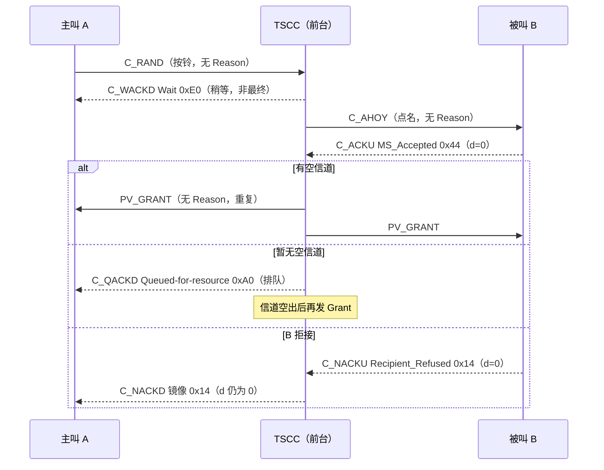

# 第 34 课 · Reason Code 怎么读

> DMR 深入学习 · **阶段 E · 集群 Tier III 第 4 课（约 10 课之四）**（接第 33 课「Grant 变体地图」）  
> 适合：已经会画「守 TSCC →（登记）→ C_RAND → Grant → 进 Payload」总图、也会认 PV/TV/PD 等 Grant 票样，但现场一遇到「**呼不出去 / 一直排队 / 登记不上**」就只会说「被拒了」——说不出**谁拒的、为什么拒、是最终结论还是让你等**——的人  
> 阅读量：约 **30–40 分钟** · **少公式、不贴矩阵、不画完整 SDL** · 要把「**看见拒绝/排队，先找确认族 CSBK（C_ACKD / C_ACKU / P_ACKD / P_ACKU）→ 把 8 bit Reason 拆成 tt / d / aaaaa → 先问最终还是中间 → 再问网络拒还是对方拒 → 最后对表查名字，并顺手读 Response_Info**」钉牢  
> **频谱 / 调制提醒（一小段，不是本课主线）**：RF 仍是 **12.5 kHz**；调制仍是 **4FSK**；空口仍是 **2-slot TDMA**，时隙 **30 ms**。**拒绝理由是控制面里的 8 个比特，不是射频指标**——看见 `SYSbusy_Refused` 却去查驻波、看见 `MSaway_Refused` 却去换天线、看见 `Wait` 却以为「调制解不出来」，都是把账记错了本。频率/带宽/调制四句话见 `学习推送/加餐_频率带宽与调制解调.md`；本课主线是 **阶段 E 第 4 站：读懂前台的「回条」**。

---

## 1. 为什么本课重要（动机）

第 33 课结尾有一句话：**成功路径是 Grant（无 Reason）；失败路径才是 NACK Reason。** 今天就把「失败路径」和「等一等路径」摊开。

现场你一定遇到过这些对话：

- 调度：「他按了 PTT，嘟一声就没了。」——你打开监听，看见一条 **C_ACKD**。同事说：「ACK？那不是成功了吗？」——其实 **C_ACKD 这个名字下装着 ACK / NACK / QACK / WACK 四种回条**，要看 Reason 的头两位才知道是哪种。  
- 用户：「手台一直显示『排队中』。」——你看见 `0xA0`，有人说「A0 是错误码」，其实它是 **QACK · Queued-for-resource**：不是拒绝，是「你排上队了，等信道空出来再发 Grant」。  
- 新站开通当天：「一半手台登记不上。」——你看见 `0x2A` 和 `0x2B` 混着出现。一个是 **Reg_Refused（可以换站再试）**，一个是 **Reg_Denied（被这个 TSCC 赶走、记进拒绝名单）**，处理方式完全不同。  
- 个呼：「对方明明开着机，系统说不在。」——是 `0x24 NoregMSaway_Refused`（**对方没登记**）还是 `0x25 MSaway_Refused`（**对方登记了，但无线检查没回**）？前者查对方登记，后者查对方覆盖/电池/是否在别的业务里。  
- 双工个呼：「双工打不通，半双工能通。」——是网络说 `0x31 Duplex_Congestion`（双工资源不够），还是对方手台说 `0x16 MS_Duplex_Not_Supported`（它根本不支持全双工）？第 33 课讲的 **PV_GRANT_DX**，这里拿到了反面。  
- 分析仪原始字节「2A 4E」——新人直接把 `0x2A` 念成 Reg_Refused，结果真正的 Reason 是 `0x27 SYSbusy_Refused`。**Reason 跨了两个字节**，这是本课最阴的坑（§3.3）。

培训台若只背「NACK = 被拒」，后面会一直卡在同一处：

> **看见回条 ≠ 知道结论。** 读 Reason = 先认 **载体**（CSBKO 32/33/34/35，确认族；Grant/Aloha/Ahoy/RAND 都**不带** Reason）→ 再把 8 bit 拆成 **tt（哪类回条）/ d（谁的意见）/ aaaaa（具体原因）** → 先判 **最终（ACK/NACK）还是中间（QACK/WACK）** → 再判 **网络（TS）拒还是对方手台（MS）拒、是不是 Mirrored_Reason 转述** → 再对表查名字 → 最后按 Reason 读 **Response_Info**（7 bit，含义跟着 Reason 变）。

本课目标：能画出「C_RAND → 回条（ACK/NACK/QACK/WACK）→（成功）Grant」总图；会背确认族载体与字段顺序；会把任意一个 Reason 十六进制值**心算**拆成 tt/d/aaaaa；会用「首位十六进制」速判类别；会分桶记忆常见 NACK（权限 / 对方状态 / 系统资源 / 登记 / 双工 / 其它）；会认 Mirrored_Reason；会按 Reason 读 Response_Info；会把这些和现场控制器设置（排队、碰撞拒绝、防刷）对上号；并为第 35 课「鉴权挑战响应」留好边界。

**本课硬禁令（写进脑子）**：不 dump FEC/CRC、不贴完整 SDL/MSC、不发明 ETSI 条款号（入口锚点以资料库 `04-集群协议/ReasonCode与Grant变体.md` **§0–§9**、`集群协议字段速览.md` **§7–§8**、`总索引.md` **集群 / Tier III** 已有编号为准）、**不回头把第 33 课 Grant 变体再 dump 一遍**（只回唤「Grant 无 Reason」）、**不讲鉴权算法/RC4**（第 35 课；本课只认 `0x48 / 0x64 Authentication Response` 这两个名字）、**不讲 CHAN 绝对频率公式**（第 36）、**不讲 Hunt/拨号/Stun 状态机**（第 37–39；本课只认 Stun 相关拒因名字）、**不重 dump 第 32 课登记 MSC 与 Aloha 字段**。本课只钉 **Reason Code 读法**。

---

## 2. 总图 / 故事：「前台的回条」

### 2.1 一句话故事：按铃之后，前台只会给你四种回条之一

继续第 31–33 课的旅馆：**前台（TSCC）发房间小票（Grant）；客房（Payload）才说话；没办入住（登记）别想要房。**

你在前台按铃（**C_RAND**）要房间之后，前台的反应只有这几种：

1. **直接给小票（Grant）**——成功，什么理由都不用写。第 33 课的内容。  
2. **「好的，收到」条（ACK）**——这是**最终**的肯定回答，常见于登记成功、短消息已接收、状态轮询已接收；条子上写着「为什么好」（如 `Reg_Accepted`）。  
3. **「不行」条（NACK）**——**最终**否定，条子上**必须**写理由：你没权限？对方不在？系统太忙？你没登记？……  
4. **「排队」条（QACK）**——**不是最终**：「收下了，现在没空房/对方占线，排上了，后面还有信令（多半是一张 Grant）。」  
5. **「请稍等」条（WACK）**——**不是最终**：「收下了，正在办，后面还有信令。」登记、呼叫建立中常见。

再加两条细节：

6. **有些「不行」不是前台的意见，而是被叫客人的意见**——比如被叫手台说「我拒接」「我不支持」。前台把客人的原话**原样转述**给你，这叫 **Mirrored_Reason（镜像理由）**；条子上的方向位 `d` 保持 `0`（MS 的意见），你一眼能看出「不是系统拒的，是对方拒的」。  
7. **条子的角落还有一小栏备注（Response_Info，7 bit）**——写什么取决于理由：登记成功时写「省电偏移」；组附着时写「哪几个组收下了」；其它大多数情况写「个号/组号标志 + 一个站点校验码」。

口诀：**先看是不是回条（CSBKO 32/33/34/35）→ 拆 8 位（tt·d·aaaaa）→ 先问「完没完」（最终/中间）→ 再问「谁说的」（网/对方/转述）→ 再查名字 → 最后读角落备注。**

### 2.2 总图：一次请求的所有可能出口

```text
  时间 →

  ┌─ 守 TSCC（第 31–32 课）：已读 Aloha，必要时已登记 ───────┐
  └──────────────────────┬──────────────────────────────────┘
                         ▼
  ┌─ MS → TS：C_RAND（CSBKO 31，按铃）── 无 Reason ─────────┐
  │  Service_Kind / Service_Options = 我要办什么              │
  └──────────────────────┬──────────────────────────────────┘
                         ▼
        （可选）TS → 被叫：C_AHOY（CSBKO 28，点名）── 无 Reason
                 被叫 → TS：C_ACKU / C_NACKU（CSBKO 33）── 有 Reason（d=0）
                         ▼
  ┌─ TS → 主叫：确认族 C_ACKD（CSBKO 32）── 有 Reason ──────┐
  │   tt=11 WACK  "稍等"  ───┐  非最终：后面还有信令          │
  │   tt=10 QACK  "排队"  ───┤                                │
  │   tt=01 ACK   "好了"  ───┼─ 最终（登记/短数据/状态等）     │
  │   tt=00 NACK  "不行"  ───┴─ 最终（附理由；呼叫到此结束）   │
  └──────────────────────┬──────────────────────────────────┘
                         ▼（语音/数据呼叫成功）
  ┌─ TS → 主被叫：Grant 族（CSBKO 48–56）── 无 Reason ──────┐
  │   第 33 课：常重复发；不要求确认                           │
  └──────────────────────┬──────────────────────────────────┘
                         ▼
  ┌─ Payload（客房）：P_ACKD / P_ACKU（CSBKO 34/35）────────┐
  │   结构同 TSCC 确认族；Reason 表完全相同                    │
  └─────────────────────────────────────────────────────────┘
```

同一件事用时序图再看一遍（主叫 A、TSCC、被叫 B）：



### 2.3 和第 25 / 30 / 31 / 32 / 33 课怎么咬合？

| 课 | 你已经会 / 本课加上 |
|----|---------------------|
| 第 25 / 30 | Tier II 个呼的 `UU_V_Req → UU_Ans_Rsp / NACK_Rsp`（CSBKO `100110`=38，**Part2**）——本课的 Tier III 拒绝**不是**它，是 Part4 的 C_NACKD（CSBKO 32） |
| 第 31 | TSCC vs Payload——确认族在 TSCC 是 C_，在 Payload 是 P_（结构相同） |
| 第 32 | 登记 + Aloha——登记成功/失败的「结论」就落在本课的 `0x62 / 0x65 / 0xE0 / 0x2A / 0x2B / 0x2D` |
| 第 33 | Grant 变体——**成功路径**；本课是失败/中间路径；DX 双工的反面理由 `0x31 / 0x16` 在这里 |
| **本课** | **Reason Code 读法 = 阶段 E 第 4 站** |
| 第 35（预告） | 鉴权挑战响应——本课只认名字 `0x48 / 0x64`，不讲算法 |

四句话串起来：

1. **第 32 课**：没登记先别要房；登记的结论在 ACK/NACK 里。  
2. **第 33 课**：成功就是一张 Grant 小票，**票上没有理由栏**。  
3. **本课**：不成功、或者还没成功，前台给的是**回条**；理由就在回条的 8 个比特里。  
4. **射频账本不变**：仍是 12.5 kHz / 4FSK / 双时隙——Reason 是**业务结论**，不是信号质量。

### 2.4 调制账本钩子（巩固弱项，不重开加餐）

1. **带宽**：回条和 Grant 一样走在 **12.5 kHz** 的 TSCC 上（或 Payload 上的 P_ACK）；没有「拒绝专用频率」。  
2. **多址**：仍是 **2-slot TDMA**、时隙 **30 ms**；一条确认 CSBK 就是一个突发里的 96 bit 块（第 15–24 课的外壳）。  
3. **调制**：仍是 **4FSK ≈ 4800 baud ≈ 9.6 kbps** 毛速率——ACK 和 NACK 只差几位比特，**调制完全一样**。  
4. **解调直觉**：**能读出 Reason，就说明解调没问题。** 解调真坏了，你看到的是 CRC 错/解不出 CSBK，而不是一条干干净净的 `SYSbusy_Refused`。所以：**看到清晰的拒因 → 去查业务/配置/容量/对方状态；看不到任何回条 → 才回头查射频与覆盖。**  
细节回 `学习推送/加餐_频率带宽与调制解调.md`。

---

## 3. 载体：Reason 住在哪几种 CSBK 里

Canonical：`ReasonCode与Grant变体.md` **§5**；速览 **§7 / §8**。

### 3.1 只有「确认族」带 Reason

| CSBKO（十进制 / 二进制） | 别名 | 方向 · 信道 | 能装哪几类回条 |
|--------------------------|------|-------------|----------------|
| **32** / `100000` | **C_ACKD**（统称；按 tt 又叫 C_NACKD / C_QACKD / C_WACKD） | TS → MS · TSCC | ACK / NACK / QACK / WACK |
| **33** / `100001` | **C_ACKU**（又叫 C_NACKU） | MS → TS · TSCC | 只有 ACK / NACK（入站没有排队/稍等） |
| **34** / `100010` | **P_ACKD**（P_NACKD） | TS → MS · Payload | 同 C_ACKD 结构 |
| **35** / `100011` | **P_ACKU**（P_NACKU） | MS → TS · Payload | 同 C_ACKU 结构 |

**不带 Reason 的「邻居」**（看见它们别去找理由栏）：

| PDU | CSBKO | 为什么没有 Reason |
|-----|-------|-------------------|
| C_ALOHA | 25 | 是告示牌（第 32 课）；Reg=1 的后果在后续 NACK `0x2D` 里 |
| C_AHOY | 28 | 是点名；「查什么」写在 Service_Kind；回答在被叫的 C_ACKU 里 |
| C_RAND | 31 | 是按铃；理由是前台给的，不是你自己写的 |
| C_ACKVIT | 30 | 鉴权挑战路径（第 35 课）；答案在随后 C_ACKU `0x48` |
| Grant 族 | 48–56 | 成功小票（第 33 课）；**成功不靠 Reason 表达** |
| C_BCAST | 40 | 公告；用 Announcement_type，不是 Reason |

**一句话**：同一个 CSBKO 32 装四种回条，**区分它们的不是 Opcode，而是 Reason 的头两位 tt**。这点和第 33 课相反——Grant 是「Opcode 定票样」，回条是「Reason 头两位定类别」。

### 3.2 字段顺序（C_ACKD，64 bit 信息部分）

```text
  Octet 0 : LB(1)=1 | PF(1) | CSBKO(6)=100000
  Octet 1 : FID(8)=0000 0000
  ── 以下 64 bit ──────────────────────────────────────
  Response_Info (7)      ← 角落备注，含义随 Reason 变（§9）
  Reason Code   (8)      ← 本课主角：tt(2) d(1) aaaaa(5)
  Reserved      (1)=0
  Target address (24)    ← 当初发请求的那台 MS
  Additional Info / Source (24) ← 请求的目的（被叫/组/网关）
```

C_ACKU（33）结构相同，只是 Target 位置在鉴权时装 24 bit 挑战响应（第 35 课），Source 是**发这条确认的 MS 自己**。

开源解码器 DMRDecode 的注释写的也是这套顺序：从 CSBK 第 0 位起数（Octet 0–1 占第 0–15 位），第 16–22 位是 Response_Info，第 23–30 位是 Reason Code，第 31 位保留，然后两个 24 位地址——和库内整理一致（见 §18 外链）。

### 3.3 最阴的坑：Reason 跨了两个字节

7 + 8 + 1 = 16 bit，刚好占 Octet 2 和 Octet 3 两个字节，但**分界不在字节边界上**：

```text
            Octet 2                    Octet 3
   ┌───────────────────────┬──┐ ┌──────────────────────┬──┐
   │ Response_Info (7 bit) │R7│ │ Reason bit6 … bit0    │Rs│
   └───────────────────────┴──┘ └──────────────────────┴──┘
                            ▲                            ▲
                     Reason 最高位                     Reserved=0
```

所以 **Reason = (Octet2 的最低位 × 128) + (Octet3 ÷ 2，取整)**。写成位运算就是 `Reason = ((Oct2 & 0x01) << 7) | (Oct3 >> 1)`。

**例 A**：原始字节 `Oct2 = 0x2A`，`Oct3 = 0x4E`。

- 新人直接念：「0x2A，Reg_Refused！」——错。  
- 正确：`Oct2 & 1 = 0`；`0x4E >> 1 = 0x27`；Reason = **`0x27` = `0010 0111₂` = SYSbusy_Refused（网络过载）**。  
- 顺手：`Oct2 >> 1 = 0x15 = 001 0101₂` 是 Response_Info → G/I=`0`（个号）、Response_Check=`010101₂`。

**例 B**：原始字节 `Oct2 = 0x0B`，`Oct3 = 0xC0`。

- 只看 `Oct3 >> 1 = 0x60`，会念成「Message_Accepted，成功！」——错。  
- 正确：`Oct2 & 1 = 1` → 最高位是 1；Reason = `0x80 | 0x60` = **`0xE0` = WACK Wait（稍等，非最终）**。  
- **丢掉一个最高位，WACK 就变成了 ACK**——现场判断「到底成功没有」完全反了。

> 好消息：你手里的分析仪/解码软件大多已经帮你拼好了 Reason。这一节是为了**当软件显示可疑、或你只拿到十六进制原始字节时**，你能自己核一遍。

---

## 4. 8 bit 拆法：tt · d · aaaaa

Canonical：`ReasonCode与Grant变体.md` **§1**（clause 7.2.8.0，表 7.42–7.45）。

### 4.1 骨架

```text
   bit7 bit6 │ bit5 │ bit4 bit3 bit2 bit1 bit0
     t    t  │  d   │  a    a    a    a    a
   ──────────┼──────┼─────────────────────────
   回条类别  │ 谁的意见 │      具体原因（5 bit，最多 32 种）
```

| 场 | 位数 | 编码 | 白话 |
|----|------|------|------|
| **tt** | 2 | `00` NACK · `01` ACK · `10` QACK · `11` WACK | 这张条子是「不行 / 好了 / 排队 / 稍等」 |
| **d** | 1 | `1` = TS → MS（**网络的意见**）· `0` = MS → TS（**手台的意见**，或网络原样转述手台的意见） | 谁说的 |
| **aaaaa** | 5 | 查表 | 为什么 |

**规范要点**：QACK / WACK 只有 TS → MS（`d=1`）；入站 C_ACKU 只有 ACK / NACK。

### 4.2 「首位十六进制」速判（本课最实用的一张表）

因为 tt 占最高两位、d 占第三位，**Reason 的第一个十六进制数字就已经告诉你类别和方向**：

| 首位 hex | 二进制前三位 | tt | d | 白话 | 常见值 |
|----------|--------------|----|---|------|--------|
| **0x0_ / 0x1_** | `000` | NACK | 0 | **手台（对方）拒绝** | 0x00, 0x14, 0x16 |
| **0x2_ / 0x3_** | `001` | NACK | 1 | **网络拒绝** | 0x27, 0x2A, 0x2D, 0x31 |
| **0x4_ / 0x5_** | `010` | ACK | 0 | **手台接受**（或网络转述） | 0x44, 0x46 |
| **0x6_ / 0x7_** | `011` | ACK | 1 | **网络接受** | 0x60, 0x62, 0x65 |
| 0x8_ / 0x9_ | `100` | QACK | 0 | （规范未用：入站无排队） | — |
| **0xA_ / 0xB_** | `101` | QACK | 1 | **网络：排队中** | 0xA0, 0xA1 |
| 0xC_ / 0xD_ | `110` | WACK | 0 | （规范未用） | — |
| **0xE_ / 0xF_** | `111` | WACK | 1 | **网络：请稍等** | 0xE0 |

口诀：**「零一对方拒，二三网络拒；四五对方收，六七网络收；A B 排队，E F 稍等。」**

看见 `0x8_ / 0x9_ / 0xC_ / 0xD_`：先怀疑**拼字节拼错了**（§3.3），或者是厂商私有 FID 下的东西，而不是标准 Reason。

### 4.3 手算三遍（拆给你看）

| Reason | 二进制 | tt | d | aaaaa | 查表结果 |
|--------|--------|----|---|-------|----------|
| `0x27` | `00 1 00111` | 00 NACK | 1 网络 | 00111 | **SYSbusy_Refused**：网络过载 |
| `0x14` | `00 0 10100` | 00 NACK | 0 手台 | 10100 | **Recipient_Refused**：被叫用户拒接 |
| `0xA0` | `10 1 00000` | 10 QACK | 1 网络 | 00000 | **Queued-for-resource**：排队等资源 |
| `0x62` | `01 1 00010` | 01 ACK | 1 网络 | 00010 | **Reg_Accepted**：登记成功 |
| `0xE0` | `11 1 00000` | 11 WACK | 1 网络 | 00000 | **Wait**：稍等，后面还有信令 |
| `0x44` | `01 0 00100` | 01 ACK | 0 手台 | 00100 | **MS_Accepted**：被叫手台接受 |

**注意**：同一个 aaaaa 在不同 tt 下意思完全不同。`aaaaa=00000` 在网络 NACK 里是 `Not_Supported (0x20)`，在网络 ACK 里是 `Message_Accepted (0x60)`，在 QACK 里是 `Queued-for-resource (0xA0)`，在 WACK 里是 `Wait (0xE0)`。**所以永远整 8 位一起查表，别只记后 5 位。**

---

## 5. 先分「最终」还是「中间」

| 类别 | tt | 最终？ | 后面还会发生什么 | 现场一句话 |
|------|----|--------|------------------|------------|
| **ACK** | 01 | ✅ 最终 | 对登记/短数据/状态等，事情就办完了；对呼叫类，可能是把被叫的「接受」转述给主叫（Mirrored），随后才有 Grant | 「办好了」 |
| **NACK** | 00 | ✅ 最终 | **这次请求到此结束**；手台通常提示失败音/失败文字 | 「不行，理由是……」 |
| **QACK** | 10 | ❌ 中间 | 还在系统里排着；后面多半是 Grant，也可能最终以 NACK 收场（看厂商定时器策略） | 「排上了，别重按」 |
| **WACK** | 11 | ❌ 中间 | 还在办；后面是 ACK / NACK / Grant 之一 | 「在办，等一下」 |

两个现场常识：

1. **排队期间反复按 PTT 是坏习惯**。QACK 之后再按，等于再发一次 C_RAND；有的控制器会把频繁重复请求当「刷屏」处理并回 NACK（§12 的 KAIROS 例子里叫 Flooding Filter）。  
2. **主叫想撤回排队中的呼叫**，网络可能回 `0x29 Call_Cancel_Refused`——「已经撤不回了，呼叫可能照样接通」。看到它别惊讶：这不是系统坏了，是撤销来晚了。
