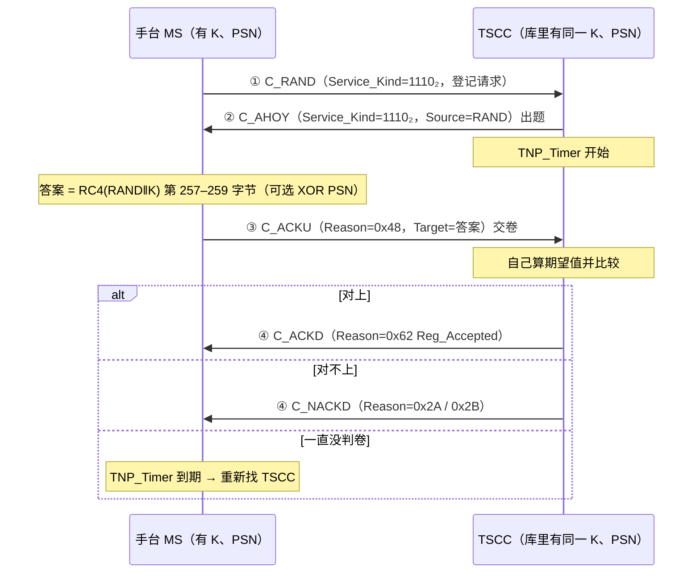

# 第 35 课 · 鉴权挑战响应（边界：RC4）

> DMR 深入学习 · **阶段 E · 集群 Tier III 第 5 课（约 10 课之五）**（接第 34 课「Reason Code 怎么读」）  
> 适合：已经会画「守 TSCC →（登记）→ C_RAND → 回条/Grant → 进 Payload」总图、也会把 Reason 拆成 tt/d/aaaaa，但一听到「**这台手台鉴权没过**」「**开了鉴权一半手台登记不上**」「**遥毙要先鉴权**」就只会说「密钥不对吧」——说不出**谁出题、题在哪个字段、答案在哪个字段、秘密有没有上空口、RC4 到底管到哪一步**——的人  
> 阅读量：约 **30–40 分钟** · **少公式、不贴矩阵、不画完整 SDL、不讲 RC4 的密码学证明** · 要把「**鉴权 = 前台出一道 24 bit 的随机题（C_AHOY 的 Source 栏）→ 手台用只有它和网络知道的 128 bit 钥匙 K 算出 24 bit 答案（C_ACKU 的 Target 栏，Reason=0x48）→ 网络自己也算一遍、对得上就放行；钥匙 K 永远不上空口**」钉牢  
> **频谱 / 调制提醒（一小段，不是本课主线）**：RF 仍是 **12.5 kHz**；调制仍是 **4FSK**；空口仍是 **2-slot TDMA**，时隙 **30 ms**。**鉴权是控制面里的一道算术题，不是射频指标**——鉴权失败去换天线、去调频偏，就跟上节课「看见 SYSbusy 去查驻波」一样，把账记错了本。频率/带宽/调制四句话见 `学习推送/加餐_频率带宽与调制解调.md`；本课主线是 **阶段 E 第 5 站：前台凭什么相信你是你**。

---

## 1. 为什么本课重要（动机）

第 34 课结尾有一句话：**Reason 告诉你「结论」；鉴权告诉你「凭什么相信你是你」。** 今天就把「凭什么」拆开。

先想一个最朴素的问题：**集群网凭什么相信「个号 1001」真的是 1001？**

- 第 32 课的登记：手台在 C_RAND 里写上「我是 1001」——这只是**自报家门**。  
- 第 14 课的 SFID/MFID、第 20 课的 Colour Code：那是「**我们是不是同一个系统**」的门槛，不是「**你是不是你**」的证明。  
- 任何人只要买一台能写频的手台、把个号写成 1001，就能**自报家门**为 1001。

如果网络只听自报家门，就会出现现场最怕的几件事：

- **克隆机**：有人把一台旧手台写成值班长的个号，混进调度组听、甚至讲。  
- **丢失机**：手台丢了，网上还认它，捡到的人照样能呼叫。  
- **假基站反向骗手台**：有人冒充 TSCC 给手台发「遥晕/遥毙」，把一批手台弄成砖头（这就是为什么**Kill 必须鉴权**，§6.4）。

ETSI 在 Part 4 里给的答案就是本课的主角：**挑战–响应鉴权（Challenge and Response Authentication，条款 6.4.8）**。

现场你一定遇到过这些对话：

- 网管：「新开了鉴权，A 批手台都过了，B 批全部登记不上。」——不是射频坏了，十有八九是 **B 批手台的 K 没录进网管**，或者 **PSN 用没用两边不一致**（§3、§9）。  
- 调度：「这台手台以前好好的，返厂修完回来就登记不上。」——返厂可能**换了主板**：PSN 是出厂固化在硬件里的（§3.2），**网管里那条记录还是旧的**。  
- 分析仪：「我看见 TSCC 发了一条 C_AHOY 给 1001，可我没发起呼叫啊？」——C_AHOY 不只用来「点名被叫」（第 34 课），**Service_Kind=1110₂、Source 栏是一串随机数**的那种，是**前台在出题**（§4.1）。  
- 分析仪：「1001 回了一条 C_ACKU，Reason=0x48，Target 是个看不懂的数，不是任何个号。」——那个「看不懂的数」就是**答案**（§4.2）。新人最常把它误读成「被叫地址」。  
- 网管：「遥毙下发了，手台回了 `0x14 Recipient_Refused`。」——不是用户拒接，是**手台反过来鉴权网络、没通过，所以拒绝执行**（§6.4）。  
- 采购/安全：「我们的鉴权用的是 RC4，听说 RC4 早被淘汰了，是不是等于没鉴权？」——这句话一半对一半错，§8 专门讲**边界**。

培训台若只背「鉴权 = 对密码」，后面会一直卡在同一处：

> **鉴权 ≠ 加密，鉴权 ≠ 登记，鉴权 ≠ Colour Code。** 鉴权只回答一个问题：「**这台设备手里有没有那把只有它和网络才知道的钥匙 K？**」它的做法是：**网络当场出一道随机题（RAND，24 bit）→ 手台用 K 把题算成答案（24 bit）→ 网络用同一把 K 自己算一遍 → 对得上就信。钥匙本身从不上空口。**

本课目标：能画出「C_RAND → C_AHOY（出题）→ C_ACKU（交卷，0x48）→ C_ACKD/C_NACKD（判卷）」总图；会说清 **K / PSN / RAND / Response** 四个量谁持有、多宽、上不上空口；会在原始字节里**指出题目和答案住在哪几个字节**；会用一句话复述 RC4 在这里的用法（`RC4(RAND‖K)` → 259 字节 → 弃 256 → 取末 3 → 可选 XOR PSN）并**亲手核对一次官方测试向量**；会画**反向鉴权**（Stun/Kill：C_ACKVIT 出题 → C_ACKD 0x64 交卷 → MS_Accepted / Recipient_Refused 判卷）；会把「鉴权失败」和「登记拒绝 / 超时猎站」对上号；会说清 **RC4 边界：本 TS 写了什么、没写什么、鉴权不等于话音加密**；并为第 36 课「频率 CHAN / 绝对频率」留好边界。

**本课硬禁令（写进脑子）**：不 dump FEC/CRC、不贴完整 SDL/MSC、不发明 ETSI 条款号（入口锚点以资料库 `04-集群协议/鉴权与AnnexC频率.md` **§0–§6**、`ReasonCode与Grant变体.md` **§8.2**、`Stun_DGNA_UDT与定时器.md` **§1.3–§1.4**、`总索引.md` **集群 / Tier III** 已有编号为准）、**不讲 RC4 的 S-box 证明与攻击论文细节**（只讲「它在这里怎么用、边界在哪」）、**不讲 K 怎么生成、PSN 工厂怎么编码**（规范明说厂商自定）、**不讲话音/数据加密方案**（Privacy 不在 Part 4，§8.3）、**不讲 CHAN 绝对频率公式**（第 36 课；资料库同一文件的第二部分）、**不讲 Hunt / 拨号 / Stun 完整状态机**（第 37–39 课；本课只讲 Stun/Kill 里那段反向鉴权）、**不重 dump 第 32 课登记 MSC 与第 34 课 Reason 全表**（只回唤用得到的几个值）。本课只钉 **挑战–响应鉴权的流程、字段落点和 RC4 边界**。

---

## 2. 总图 / 故事：「前台出题，你交卷」

### 2.1 一句话故事：对暗号，但暗号每次都换

继续第 31–34 课的旅馆：**前台（TSCC）发房间小票（Grant）；客房（Payload）才说话；没办入住（登记）别想要房；前台给回条（ACK/NACK/QACK/WACK）。**

现在旅馆升级了安保。你走到前台说「我是 1001 房的老客户，要办入住」（**C_RAND**）。前台不再光看你嘴上说的房号，而是这么做：

1. **前台从抽屉里摸出一张刚印的随机题卡**，上面是一个 6 位十六进制数，比如 `7A17C0`，大声念给你（**C_AHOY，Source 栏 = RAND**）。这一步同时也等于告诉你「你的请求我收到了，别再按铃了」。  
2. **你手里有一本只有你和前台才有的密码本（K，128 bit）**。你按旅馆规定的固定算法（**RC4**）把「题卡 + 密码本」搅一搅，得到一个 6 位十六进制答案，比如 `E8CA1D`，念给前台（**C_ACKU，Reason=0x48 Authentication Response，Target 栏 = 答案**）。  
3. **前台也有一份你的密码本副本**，用同样的算法自己算一遍。对上了，给你办入住（**C_ACKD Reg_Accepted** 或继续发 Grant）；对不上，请你走人（**C_NACKD Reg_Refused / Reg_Denied** 等）。

关键在三点：

- **密码本从头到尾没离开过你的口袋**，也没离开过前台的抽屉。空气里只出现了「题」和「答」。  
- **题每次都不一样**。路过的人就算偷听到「`7A17C0` → `E8CA1D`」，下次前台出的是另一道题，他背下来的旧答案没用（这叫**防重放**）。  
- **有些客人的身份证上还有一个钢印号（PSN）**，出厂打上、改不掉。如果旅馆启用了钢印核对，你念答案之前还要把答案和钢印号「对位相加（XOR）」一下。这样**就算有人偷抄了你的密码本、却没有你这台机器的钢印，也算不对**（§3.2）。

反过来还有一种场景：**前台要「遥晕/遥毙」你**（Stun/Kill，第 39 课细讲）。这时轮到**你怀疑前台**：「你真是这家旅馆的前台吗？」于是**你出题**（**C_ACKVIT**），**前台交卷**（**C_ACKD，Reason=0x64**），**你判卷**（通过 → **MS_Accepted**，乖乖执行；不通过 → **Recipient_Refused**，不执行）。

口诀：**谁怀疑谁出题；题走 Source/Target 栏，答走 Target/AddInfo 栏；钥匙 K 不出门；Reason 0x48 是手台交卷，0x64 是网络交卷。**

### 2.2 总图：一次「登记 + 鉴权」的全过程

```text
  时间 →

  ┌─ 守 TSCC（第 31–32 课）：已读 C_ALOHA，决定要登记 ─────────────┐
  └─────────────────────────┬──────────────────────────────────────┘
                            ▼
  ┌─ ① MS → TS：C_RAND（CSBKO 31，按铃）──────────────────────────┐
  │   Service_Kind = 1110₂（登记/鉴权/无线检查共用）                 │
  │   Target = REG_ADDR 网关；Source = 我的个号（自报家门）          │
  │   —— 这里还没有题，也没有答 ——                                   │
  └─────────────────────────┬──────────────────────────────────────┘
                            ▼
  ┌─ ② TS → MS：C_AHOY（CSBKO 28，出题）──────────────────────────┐
  │   Service_Kind = 1110₂，G/I = 0（个号），Flag = 0               │
  │   Target = 被挑战手台个号                                       │
  │   Source = RAND（24 bit，00 0000₁₆ … FF FCDF₁₆）  ← 题           │
  │   作用 ×2：①确认收到 C_RAND（别再按铃）②出题；TNP_Timer 起跑     │
  └─────────────────────────┬──────────────────────────────────────┘
                            ▼        （手台：RC4(RAND‖K)→259 B→弃 256→取 3 B
                            ▼                  →（可选）XOR PSN = 答案）
  ┌─ ③ MS → TS：C_ACKU（CSBKO 33，交卷）──────────────────────────┐
  │   Reason = 0100 1000₂ = 0x48 Authentication Response（d=0）      │
  │   Target = 答案（24 bit）                         ← 答           │
  │   Additional Information = 我的个号                              │
  └─────────────────────────┬──────────────────────────────────────┘
                            ▼        （网络：用库里的 K、PSN 算期望值，比较）
  ┌─ ④ TS → MS：判卷 ─────────────────────────────────────────────┐
  │   对上：C_ACKD Reason=0x62 Reg_Accepted（登记成功）              │
  │   对不上：C_NACKD Reason=0x2A Reg_Refused / 0x2B Reg_Denied      │
  │   没回音：MS 等 TNP_Timer 到期 → 重新找 TSCC（猎站，第 37 课）    │
  └────────────────────────────────────────────────────────────────┘

  空气里出现过的：自报的个号、RAND、答案、Reason。
  空气里从没出现过的：K（128 bit）、PSN（3 字节）。
```

同一件事画成时序图（只画逻辑，不画槽位；对齐/偏移时序以 PDF Fig 6.20 为准）：



### 2.3 和第 20 / 32 / 34 课怎么咬合？

| 课 | 你已经会 / 本课加上 |
|----|---------------------|
| 第 14 / 20 | SFID/MFID、Colour Code——「**是不是同一个系统 / 同一个站**」的门槛；**不证明身份** |
| 第 23 | CSBK 外壳：LB / PF / CSBKO / FID + 64 bit 信息——本课四种 PDU 全是这个外壳 |
| 第 31 | TSCC vs Payload——鉴权一般在 TSCC 做；在业务信道上做时换成 P_AHOY / P_ACKU（结构相同） |
| 第 32 | 登记——鉴权是登记里的**可选中间步骤**（条款 6.4.4.1.5）：C_RAND 和终 ACK 之间多插一问一答 |
| 第 34 | Reason——本课只用到 `0x48`（手台交卷）、`0x64`（网络交卷）、`0x62`、`0x2A / 0x2B`、`0x44`、`0x14`、`0x00`；**跨字节坑在本课再踩一次**（§4.5） |
| **本课** | **挑战–响应鉴权 = 阶段 E 第 5 站** |
| 第 36（预告） | 频率 CHAN / 绝对频率——资料库同一个文件 `鉴权与AnnexC频率.md` 的**第二部分**，本课不碰 |
| 第 39（预告） | Stun / DGNA / UDT——本课只讲 Stun/Kill 里「手台反向鉴权网络」那一小段 |

四句话串起来：

1. **第 20 课**：Colour Code 只说「同一个站」，不说「你是你」。  
2. **第 32 课**：登记是「自报家门 + 前台记一笔」。  
3. **本课**：鉴权是在登记（或呼叫建立）中间插一道**随机题**，答对才算数；**钥匙不出门**。  
4. **射频账本不变**：仍是 12.5 kHz / 4FSK / 双时隙——题和答都只是几个 CSBK。

### 2.4 调制账本钩子（巩固弱项，不重开加餐）

1. **带宽**：出题（C_AHOY）和交卷（C_ACKU）都走在 **12.5 kHz** 的 TSCC 上；没有「鉴权专用频率」，也不额外占带宽。  
2. **多址**：仍是 **2-slot TDMA**、时隙 **30 ms**；一问一答就是**两个突发**（各一个 96 bit 的 CSBK 信息块，外加 CRC 与 FEC——第 23–24 课的外壳），所以一次鉴权在空口上**只多花零点几秒**量级的往返（具体槽位对齐看 PDF Fig 6.20，本课不描）。  
3. **调制**：仍是 **4FSK**。RC4 是在**手台的处理器里**算的，算完的 24 bit 答案跟任何别的 24 bit 地址一样被调制发出去——**调制层根本不知道这是鉴权**。  
4. **解调直觉**：**如果你在分析仪上能看见完整的 C_AHOY 和 C_ACKU，就说明射频和解调都没问题。** 鉴权失败（答案不对）是**钥匙/配置问题**；只有「出了题却**从来没收到**交卷」时，才轮到你怀疑覆盖、入站干扰、手台发射。  
细节回 `学习推送/加餐_频率带宽与调制解调.md`。

