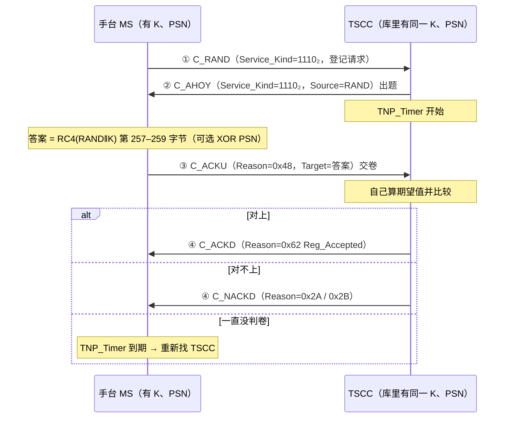

# 第 35 课 · 鉴权挑战响应（边界：RC4）

> DMR 深入学习 · **阶段 E · 集群 Tier III 第 5 课（约 10 课之五）**（接第 34 课「Reason Code 怎么读」）  
> 适合：已经会画「守 TSCC →（登记）→ C_RAND → 回条/Grant → 进 Payload」总图、也会把 Reason 拆成 tt/d/aaaaa，但一听到「**这台手台鉴权没过**」「**开了鉴权一半手台登记不上**」「**遥毙要先鉴权**」就只会说「密钥不对吧」——说不出**谁出题、题在哪个字段、答案在哪个字段、秘密有没有上空口、RC4 到底管到哪一步**——的人  
> 阅读量：约 **30–40 分钟** · **少公式、不贴矩阵、不画完整 SDL、不讲 RC4 的密码学证明** · 要把「**鉴权 = 前台出一道 24 bit 的随机题（C_AHOY 的 Source 栏）→ 手台用只有它和网络知道的 128 bit 钥匙 K 算出 24 bit 答案（C_ACKU 的 Target 栏，Reason=0x48）→ 网络自己也算一遍、对得上就放行；钥匙 K 永远不上空口**」钉牢  
> **频谱 / 调制提醒（一小段，不是本课主线）**：RF 仍是 **12.5 kHz**；调制仍是 **4FSK**；空口仍是 **2-slot TDMA**，时隙 **30 ms**。**鉴权是控制面里的一道算术题，不是射频指标**——鉴权失败去换天线、去调频偏，就跟上节课「看见 SYSbusy 去查驻波」一样，把账记错了本。频率/带宽/调制四句话见 `学习推送/加餐_频率带宽与调制解调.md`；本课主线是 **阶段 E 第 5 站：前台凭什么相信你是你**。

---

## 1. 为什么本课重要（动机）

第 34 课结尾有一句话：**Reason 告诉你「结论」；鉴权告诉你「凭什么相信你是你」。** 今天就把「凭什么」拆开。

先想一个最朴素的问题：**集群网凭什么相信「个号 1001」真的是 1001？**

- 第 32 课的登记：手台在 C_RAND 里写上「我是 1001」——这只是**自报家门**。  
- 第 14 课的 SFID/MFID、第 20 课的 Colour Code：那是「**我们是不是同一个系统**」的门槛，不是「**你是不是你**」的证明。  
- 任何人只要买一台能写频的手台、把个号写成 1001，就能**自报家门**为 1001。

如果网络只听自报家门，就会出现现场最怕的几件事：

- **克隆机**：有人把一台旧手台写成值班长的个号，混进调度组听、甚至讲。  
- **丢失机**：手台丢了，网上还认它，捡到的人照样能呼叫。  
- **假基站反向骗手台**：有人冒充 TSCC 给手台发「遥晕/遥毙」，把一批手台弄成砖头（这就是为什么**Kill 必须鉴权**，§6.4）。

ETSI 在 Part 4 里给的答案就是本课的主角：**挑战–响应鉴权（Challenge and Response Authentication，条款 6.4.8）**。

现场你一定遇到过这些对话：

- 网管：「新开了鉴权，A 批手台都过了，B 批全部登记不上。」——不是射频坏了，十有八九是 **B 批手台的 K 没录进网管**，或者 **PSN 用没用两边不一致**（§3、§9）。  
- 调度：「这台手台以前好好的，返厂修完回来就登记不上。」——返厂可能**换了主板**：PSN 是出厂固化在硬件里的（§3.2），**网管里那条记录还是旧的**。  
- 分析仪：「我看见 TSCC 发了一条 C_AHOY 给 1001，可我没发起呼叫啊？」——C_AHOY 不只用来「点名被叫」（第 34 课），**Service_Kind=1110₂、Source 栏是一串随机数**的那种，是**前台在出题**（§4.1）。  
- 分析仪：「1001 回了一条 C_ACKU，Reason=0x48，Target 是个看不懂的数，不是任何个号。」——那个「看不懂的数」就是**答案**（§4.2）。新人最常把它误读成「被叫地址」。  
- 网管：「遥毙下发了，手台回了 `0x14 Recipient_Refused`。」——不是用户拒接，是**手台反过来鉴权网络、没通过，所以拒绝执行**（§6.4）。  
- 采购/安全：「我们的鉴权用的是 RC4，听说 RC4 早被淘汰了，是不是等于没鉴权？」——这句话一半对一半错，§8 专门讲**边界**。

培训台若只背「鉴权 = 对密码」，后面会一直卡在同一处：

> **鉴权 ≠ 加密，鉴权 ≠ 登记，鉴权 ≠ Colour Code。** 鉴权只回答一个问题：「**这台设备手里有没有那把只有它和网络才知道的钥匙 K？**」它的做法是：**网络当场出一道随机题（RAND，24 bit）→ 手台用 K 把题算成答案（24 bit）→ 网络用同一把 K 自己算一遍 → 对得上就信。钥匙本身从不上空口。**

本课目标：能画出「C_RAND → C_AHOY（出题）→ C_ACKU（交卷，0x48）→ C_ACKD/C_NACKD（判卷）」总图；会说清 **K / PSN / RAND / Response** 四个量谁持有、多宽、上不上空口；会在原始字节里**指出题目和答案住在哪几个字节**；会用一句话复述 RC4 在这里的用法（`RC4(RAND‖K)` → 259 字节 → 弃 256 → 取末 3 → 可选 XOR PSN）并**亲手核对一次官方测试向量**；会画**反向鉴权**（Stun/Kill：C_ACKVIT 出题 → C_ACKD 0x64 交卷 → MS_Accepted / Recipient_Refused 判卷）；会把「鉴权失败」和「登记拒绝 / 超时猎站」对上号；会说清 **RC4 边界：本 TS 写了什么、没写什么、鉴权不等于话音加密**；并为第 36 课「频率 CHAN / 绝对频率」留好边界。

**本课硬禁令（写进脑子）**：不 dump FEC/CRC、不贴完整 SDL/MSC、不发明 ETSI 条款号（入口锚点以资料库 `04-集群协议/鉴权与AnnexC频率.md` **§0–§6**、`ReasonCode与Grant变体.md` **§8.2**、`Stun_DGNA_UDT与定时器.md` **§1.3–§1.4**、`总索引.md` **集群 / Tier III** 已有编号为准）、**不讲 RC4 的 S-box 证明与攻击论文细节**（只讲「它在这里怎么用、边界在哪」）、**不讲 K 怎么生成、PSN 工厂怎么编码**（规范明说厂商自定）、**不讲话音/数据加密方案**（Privacy 不在 Part 4，§8.3）、**不讲 CHAN 绝对频率公式**（第 36 课；资料库同一文件的第二部分）、**不讲 Hunt / 拨号 / Stun 完整状态机**（第 37–39 课；本课只讲 Stun/Kill 里那段反向鉴权）、**不重 dump 第 32 课登记 MSC 与第 34 课 Reason 全表**（只回唤用得到的几个值）。本课只钉 **挑战–响应鉴权的流程、字段落点和 RC4 边界**。

---

## 2. 总图 / 故事：「前台出题，你交卷」

### 2.1 一句话故事：对暗号，但暗号每次都换

继续第 31–34 课的旅馆：**前台（TSCC）发房间小票（Grant）；客房（Payload）才说话；没办入住（登记）别想要房；前台给回条（ACK/NACK/QACK/WACK）。**

现在旅馆升级了安保。你走到前台说「我是 1001 房的老客户，要办入住」（**C_RAND**）。前台不再光看你嘴上说的房号，而是这么做：

1. **前台从抽屉里摸出一张刚印的随机题卡**，上面是一个 6 位十六进制数，比如 `7A17C0`，大声念给你（**C_AHOY，Source 栏 = RAND**）。这一步同时也等于告诉你「你的请求我收到了，别再按铃了」。  
2. **你手里有一本只有你和前台才有的密码本（K，128 bit）**。你按旅馆规定的固定算法（**RC4**）把「题卡 + 密码本」搅一搅，得到一个 6 位十六进制答案，比如 `E8CA1D`，念给前台（**C_ACKU，Reason=0x48 Authentication Response，Target 栏 = 答案**）。  
3. **前台也有一份你的密码本副本**，用同样的算法自己算一遍。对上了，给你办入住（**C_ACKD Reg_Accepted** 或继续发 Grant）；对不上，请你走人（**C_NACKD Reg_Refused / Reg_Denied** 等）。

关键在三点：

- **密码本从头到尾没离开过你的口袋**，也没离开过前台的抽屉。空气里只出现了「题」和「答」。  
- **题每次都不一样**。路过的人就算偷听到「`7A17C0` → `E8CA1D`」，下次前台出的是另一道题，他背下来的旧答案没用（这叫**防重放**）。  
- **有些客人的身份证上还有一个钢印号（PSN）**，出厂打上、改不掉。如果旅馆启用了钢印核对，你念答案之前还要把答案和钢印号「对位相加（XOR）」一下。这样**就算有人偷抄了你的密码本、却没有你这台机器的钢印，也算不对**（§3.2）。

反过来还有一种场景：**前台要「遥晕/遥毙」你**（Stun/Kill，第 39 课细讲）。这时轮到**你怀疑前台**：「你真是这家旅馆的前台吗？」于是**你出题**（**C_ACKVIT**），**前台交卷**（**C_ACKD，Reason=0x64**），**你判卷**（通过 → **MS_Accepted**，乖乖执行；不通过 → **Recipient_Refused**，不执行）。

口诀：**谁怀疑谁出题；题走 Source/Target 栏，答走 Target/AddInfo 栏；钥匙 K 不出门；Reason 0x48 是手台交卷，0x64 是网络交卷。**

### 2.2 总图：一次「登记 + 鉴权」的全过程

```text
  时间 →

  ┌─ 守 TSCC（第 31–32 课）：已读 C_ALOHA，决定要登记 ─────────────┐
  └─────────────────────────┬──────────────────────────────────────┘
                            ▼
  ┌─ ① MS → TS：C_RAND（CSBKO 31，按铃）──────────────────────────┐
  │   Service_Kind = 1110₂（登记/鉴权/无线检查共用）                 │
  │   Target = REG_ADDR 网关；Source = 我的个号（自报家门）          │
  │   —— 这里还没有题，也没有答 ——                                   │
  └─────────────────────────┬──────────────────────────────────────┘
                            ▼
  ┌─ ② TS → MS：C_AHOY（CSBKO 28，出题）──────────────────────────┐
  │   Service_Kind = 1110₂，G/I = 0（个号），Flag = 0               │
  │   Target = 被挑战手台个号                                       │
  │   Source = RAND（24 bit，00 0000₁₆ … FF FCDF₁₆）  ← 题           │
  │   作用 ×2：①确认收到 C_RAND（别再按铃）②出题；TNP_Timer 起跑     │
  └─────────────────────────┬──────────────────────────────────────┘
                            ▼        （手台：RC4(RAND‖K)→259 B→弃 256→取 3 B
                            ▼                  →（可选）XOR PSN = 答案）
  ┌─ ③ MS → TS：C_ACKU（CSBKO 33，交卷）──────────────────────────┐
  │   Reason = 0100 1000₂ = 0x48 Authentication Response（d=0）      │
  │   Target = 答案（24 bit）                         ← 答           │
  │   Additional Information = 我的个号                              │
  └─────────────────────────┬──────────────────────────────────────┘
                            ▼        （网络：用库里的 K、PSN 算期望值，比较）
  ┌─ ④ TS → MS：判卷 ─────────────────────────────────────────────┐
  │   对上：C_ACKD Reason=0x62 Reg_Accepted（登记成功）              │
  │   对不上：C_NACKD Reason=0x2A Reg_Refused / 0x2B Reg_Denied      │
  │   没回音：MS 等 TNP_Timer 到期 → 重新找 TSCC（猎站，第 37 课）    │
  └────────────────────────────────────────────────────────────────┘

  空气里出现过的：自报的个号、RAND、答案、Reason。
  空气里从没出现过的：K（128 bit）、PSN（3 字节）。
```

同一件事画成时序图（只画逻辑，不画槽位；对齐/偏移时序以 PDF Fig 6.20 为准）：



### 2.3 和第 20 / 32 / 34 课怎么咬合？

| 课 | 你已经会 / 本课加上 |
|----|---------------------|
| 第 14 / 20 | SFID/MFID、Colour Code——「**是不是同一个系统 / 同一个站**」的门槛；**不证明身份** |
| 第 23 | CSBK 外壳：LB / PF / CSBKO / FID + 64 bit 信息——本课四种 PDU 全是这个外壳 |
| 第 31 | TSCC vs Payload——鉴权一般在 TSCC 做；在业务信道上做时换成 P_AHOY / P_ACKU（结构相同） |
| 第 32 | 登记——鉴权是登记里的**可选中间步骤**（条款 6.4.4.1.5）：C_RAND 和终 ACK 之间多插一问一答 |
| 第 34 | Reason——本课只用到 `0x48`（手台交卷）、`0x64`（网络交卷）、`0x62`、`0x2A / 0x2B`、`0x44`、`0x14`、`0x00`；**跨字节坑在本课再踩一次**（§4.5） |
| **本课** | **挑战–响应鉴权 = 阶段 E 第 5 站** |
| 第 36（预告） | 频率 CHAN / 绝对频率——资料库同一个文件 `鉴权与AnnexC频率.md` 的**第二部分**，本课不碰 |
| 第 39（预告） | Stun / DGNA / UDT——本课只讲 Stun/Kill 里「手台反向鉴权网络」那一小段 |

四句话串起来：

1. **第 20 课**：Colour Code 只说「同一个站」，不说「你是你」。  
2. **第 32 课**：登记是「自报家门 + 前台记一笔」。  
3. **本课**：鉴权是在登记（或呼叫建立）中间插一道**随机题**，答对才算数；**钥匙不出门**。  
4. **射频账本不变**：仍是 12.5 kHz / 4FSK / 双时隙——题和答都只是几个 CSBK。

### 2.4 调制账本钩子（巩固弱项，不重开加餐）

1. **带宽**：出题（C_AHOY）和交卷（C_ACKU）都走在 **12.5 kHz** 的 TSCC 上；没有「鉴权专用频率」，也不额外占带宽。  
2. **多址**：仍是 **2-slot TDMA**、时隙 **30 ms**；一问一答就是**两个突发**（各一个 96 bit 的 CSBK 信息块，外加 CRC 与 FEC——第 23–24 课的外壳），所以一次鉴权在空口上**只多花零点几秒**量级的往返（具体槽位对齐看 PDF Fig 6.20，本课不描）。  
3. **调制**：仍是 **4FSK**。RC4 是在**手台的处理器里**算的，算完的 24 bit 答案跟任何别的 24 bit 地址一样被调制发出去——**调制层根本不知道这是鉴权**。  
4. **解调直觉**：**如果你在分析仪上能看见完整的 C_AHOY 和 C_ACKU，就说明射频和解调都没问题。** 鉴权失败（答案不对）是**钥匙/配置问题**；只有「出了题却**从来没收到**交卷」时，才轮到你怀疑覆盖、入站干扰、手台发射。  
细节回 `学习推送/加餐_频率带宽与调制解调.md`。

---

## 3. 四个量：两个秘密不出门，两个公开数上空口

鉴权里一共只有四个量。**先把它们分成两堆**，后面所有内容都好懂了。

| 量 | 宽度 | 谁持有 | 上不上空口 | 白话 | 条款 |
|----|------|--------|------------|------|------|
| **K**（Authentication Key） | **128 bit**（16 字节） | 每台手台写入一份；网络（TS / 网管）存一份 | **永不** | 只有你和前台有的密码本 | 6.4.8.1.1 |
| **PSN**（Physical Serial Number） | **至少 3 字节**（计算用 3 字节） | 手台出厂固化；网络配置库里录一份 | **永不**（只影响答案的最后一步 XOR） | 机器身上改不掉的钢印号 | 6.4.8.1.2 |
| **RAND**（Challenge，题） | **24 bit** | 出题方**当场**生成 | **上**（C_AHOY 的 Source 栏，或 C_ACKVIT 的 Target 栏） | 每次都新印的题卡 | 6.4.8.2；Table 6.17 |
| **Response**（答案） | **24 bit** | 被挑战方算出 | **上**（C_ACKU 的 Target 栏，或 C_ACKD 的 AddInfo 栏） | 念给对方听的答案 | 6.4.8.3；Table 6.18 |

### 3.1 K：一台一钥，丢了只坏一台

规范对 K 只说了几件事（6.4.8.1.1）：

- **128 bit**，写入每一台手台，**同时**录入网络。  
- **怎么生成，规范不管**——「specific to each manufacturer」，厂商自定。  
- 设计上**整机寿命内有效**；如果某台的 K 泄露了，厂商可以**把手台和网管两边一起重写**。  
- 规范特别加了一条 NOTE：**泄露一把 K 只影响那一台，不影响整个系统。**

最后这条很重要：DMR 的鉴权是「**一机一钥**」，不是「全网一个口令」。所以现场开鉴权的工作量主要在**钥匙管理**：每台手台的 K 要和网管里那条记录**一一对上**。

### 3.2 PSN：钢印号，防的是「抄了钥匙的克隆机」

PSN 的规则（6.4.8.1.2）一共五条，全是「硬件身份」的味道：

1. 每台设备一个、**不可修改**；  
2. 厂商生产的每台设备**唯一**；  
3. **至少 3 字节**；  
4. 用厂商的**写频/生产工具读出**，再**录入网络配置**；  
5. **任何软件或写频操作都改不了**它。

它怎么用：手台算出 RC4 的 3 字节结果后，**逐字节 XOR 上 PSN 再发出去**；网络知道这台的 PSN，也做同样的 XOR 再比较（6.4.8.0）。

为什么要多这一步？想一想克隆场景：有人通过某种途径**拿到了 K**（比如从写频文件里），把它写进另一台手台。**如果系统启用了 PSN，克隆机的钢印号不一样，算出来的答案就不对。** K 是「软」的，可能被抄；PSN 是「硬」的，跟着那块电路板走。

兼容性：**不支持 PSN 的老手台，网络可以把它的 PSN 当成全 0**（6.4.8.0）——因为任何数 XOR 0 还是它自己，等于「不用 PSN」。

> 现场警告：**返厂换主板 = PSN 可能变了。** 如果网络启用了 PSN 而网管没更新这条记录，这台手台修完回来就会一直鉴权失败。§9 分诊表的第一行就是它。

### 3.3 RAND：24 bit 的题，范围故意卡在网关号前面

- **宽度 24 bit**，正好等于一个 DMR 地址的宽度——所以它能「借住」在 C_AHOY 的 Source 地址栏里。  
- **取值范围**：`00 0000₁₆` … `FF FCDF₁₆`（Table 6.17）。  
- 为什么上界不是 `FF FFFF₁₆`？因为 `FF FEC0₁₆` 往上是 Annex A **网关号**（REGI、STUNI、**AUTHI = `FF FECD₁₆`**、KILLI……，Table A.8）。题目要住在地址栏里，就**不能和网关号撞车**，否则手台会把一道题误读成「来自某某网关」。  
- 题必须**每次随机、不重复**才有意义（§8.2 防重放）。

范围大小：`0xFFFCDF + 1 = 16 776 416` 种题——一千六百多万。

### 3.4 Response：24 bit 的答案

- 也是 **24 bit**，也是借住在地址栏里：手台交卷时放在 C_ACKU 的 **Target** 栏，网络交卷时放在 C_ACKD 的 **Additional Information** 栏（§4）。  
- 瞎猜一次猜中的概率：\( 1 / 2^{24} = 1/16\,777\,216 \)，约一千七百万分之一。  
- 答案是**由题和钥匙决定的**：同一题、同一把 K（同一个 PSN），答案永远一样；题变一位，答案就面目全非（§5.3 亲手验证）。

---

## 4. 字段落点：题和答住在哪几个字节

四种 PDU 全是第 23 课的 CSBK 外壳：**Octet 0 = LB(1) | PF(1) | CSBKO(6)**；**Octet 1 = FID**（标准业务为 `0x00`）；**Octet 2–9 = 64 bit 信息**；后面是 CRC。

### 4.1 C_AHOY 出题（TS → MS）— Table 6.17

CSBKO = `01 1100₂` = **28**。

| IE | Len | 鉴权时取值 | 白话 |
|----|-----|-----------|------|
| Service_Options_Mirror | 7 | 登记中 / 呼叫建立中：**回拷**那条 C_RAND 的 Service_Options；**独立轮询**：`000 0000₂` | 「我是在回你哪次按铃」 |
| Service_Kind_Flag | 1 | `0` | |
| Ambient Listening Service | 1 | `0`（不适用） | |
| G/I | 1 | `0`（Target 是个号） | 鉴权永远是对**个人**出题 |
| Appended_Blocks | 2 | `00₂` | 单块 |
| **Service_Kind** | 4 | **`1110₂`** | 登记 / 鉴权 / 无线检查共用 |
| Target address | 24 | 被挑战手台的个号 | 题出给谁 |
| **Source Address or Gateway** | 24 | **RAND（题）** | ← 这里不是地址！ |

**读法要点**：普通点名用的 C_AHOY（第 34 课被叫无线检查），Source 栏放的是**主叫个号**；鉴权的 C_AHOY，Source 栏放的是**一道题**。区分靠 **Service_Kind = 1110₂ + Source 落在 `00 0000₁₆…FF FCDF₁₆`**。

**一个规范内部的小张力（知道就好）**：条款 6.6.2.1.1 讲呼叫建立的 NOTE 里说「鉴权检查的 C_AHOY 靠 Source = 网关 AUTHI 来识别」，而同一段的 d) 条和 Table 6.17 都写 Source = 挑战值。两者不能同时成立（一个 24 bit 栏放不下两样东西）。资料库的处理是：**字段以 Table 6.17 为准（Source = RAND）**；如果某款监听软件把它显示成 AUTHI，知道这段历史就不会慌。

### 4.2 C_ACKU 交卷（MS → TS）— Table 6.18 / 7.27

CSBKO = `10 0001₂` = **33**。

| IE | Len | 取值 | 白话 |
|----|-----|------|------|
| Response_Info | 7 | 普通值（第 34 课 §10） | 角落备注 |
| **Reason Code** | 8 | **`0100 1000₂` = 0x48 Authentication Response** | 「这是我的答卷」 |
| Reserved | 1 | `0` | |
| **Target address** | 24 | **答案（24 bit）** | ← 这里不是被叫！ |
| Additional Information (Source Address) | 24 | 交卷手台自己的个号 | 谁交的卷 |

小坑：Table 6.18 把 Reason 的长度印成了 **7**，但值 `0100 1000₂` 是 8 位；以 7.2.8 / Table 7.27 的 **8 bit** 为准（加上 Response_Info 7 + Reserved 1 正好 16 bit，字段才对得齐）。

拆一下 0x48（第 34 课的老手艺）：`01 0 01000` → tt=`01` **ACK**，d=`0` **手台的意见**，aaaaa=`01000`。也就是说：**交卷在格式上是一条「手台发的 ACK」**——「你的题我收到了，答案在这儿」。

### 4.3 C_ACKD 网络交卷（TS → MS，反向）— Table 6.20 / 6.24

CSBKO = `10 0000₂` = **32**。只出现在 Stun/Revive/Kill 的反向鉴权里（§6.4）。

| IE | Len | 取值 |
|----|-----|------|
| Response_Info | 7 | 普通值 |
| **Reason Code** | 8 | **`0110 0100₂` = 0x64 Authentication Response** |
| Reserved | 1 | `0` |
| Target address | 24 | 被遥晕/遥毙的手台个号 |
| **Additional Information (Source Address)** | 24 | **网络算出的答案** |

拆 0x64：`01 1 00100` → tt=`01` ACK，d=`1` **网络的意见**。**同名不同值**：两个都叫 Authentication Response，`0x48` 是手台交卷，`0x64` 是网络交卷——**d 位告诉你是谁在交卷**。

对称记法：**手台交卷，答案放 Target；网络交卷，答案放 AddInfo。**

### 4.4 C_ACKVIT 手台出题（MS → TS）— Table 7.26 / 6.21 / 6.25

CSBKO = `01 1110₂` = **30**（Ackvitation，「确认 + 邀请」的合成词）。

| IE | Len | 取值 |
|----|-----|------|
| Service_Options_Mirror | 7 | `000 0000₂` |
| Service_Kind_Flag | 1 | Stun=`0` / Revive=`1`；Kill=`0` |
| Reserved | 2 | `00₂` |
| Appended_Blocks | 2 | `00₂` |
| Service_Kind | 4 | `1101₂`（补充业务：Stun/Revive/Kill） |
| **Target address** | 24 | **手台出的题（RAND，同样的范围）** |
| Source Address | 24 | 手台自己的个号 |

它同时**兼作对那条 Stun/Kill C_AHOY 的确认**（「你的命令我收到了，但先回答我一个问题」）。

### 4.5 手拆原始字节（把第 34 课的跨字节坑再踩一遍）

假设手台个号 1001 = `0x0003E9`，独立鉴权轮询（Mirror=0），题 = `7A17C0`，没有 PSN。

**出题 C_AHOY**：

```text
Oct:   0    1    2    3    4    5    6    7    8    9
      9C   00   00   0E   00   03   E9   7A   17   C0   [CRC…]
      │    │    │    │    └─ Target ─┘  └─ Source = 题 ┘
      │    │    │    └─ ALS=0 G/I=0 AB=00 Service_Kind=1110 → 0000 1110 = 0x0E
      │    │    └─ Mirror=000 0000 + Flag=0 → 0x00
      │    └─ FID = 0x00
      └─ LB=1 PF=0 CSBKO=011100 → 1001 1100 = 0x9C
```

**交卷 C_ACKU**（答案 `E8CA1D`，§5.3 会亲手算出来；Response_Info 为讲解方便假设为 0）：

```text
Oct:   0    1    2    3    4    5    6    7    8    9
      A1   00   00   90   E8   CA   1D   00   03   E9   [CRC…]
      │         │    │    └─ Target = 答案┘  └ AddInfo=我 ┘
      │         │    └─ Reason 低 7 位 1001000 + Reserved 0 → 1001 0000 = 0x90
      │         └─ Response_Info(7)=0000000 + Reason 最高位 0 → 0x00
      └─ LB=1 PF=0 CSBKO=100001 → 1010 0001 = 0xA1
```

**跨字节坑**：在原始字节里你**看不到「48」**，看到的是 Octet 3 = **`0x90`**。按第 34 课 §3.3 的公式：`Reason = ((Oct2 & 1) << 7) | (Oct3 >> 1) = 0 | 0x48 = 0x48`。

开源 Tier III 控制器 **dmrtc**（§16 链接）在判断「这是不是一条鉴权交卷」时，代码里写的正是 `csbko == CSBKO_ACKU && csbk.getCBF() == 0x90`——`CBF` 就是 CSBK 的第 3 字节。**一行代码同时验证了本课的 §4.2 和第 34 课的跨字节坑。**

网络交卷 C_ACKD（0x64）同理：Octet 0 = `0xA0`，Octet 3 = `1100100 0` = **`0xC8`**。

---

## 5. 算法：RC4 在这里只干一件事

### 5.1 规范原话（6.4.8.0），翻成白话

> 手台用 **RC4 密钥流发生器**计算答案：**用「随机数在前、钥匙在后」拼起来作为 RC4 的密钥**，生成 **259 字节**伪随机密钥流；**前 256 字节丢掉，用最后 3 字节**。

拆成四步：

```text
  ① 拼钥匙：   RC4_key = RAND(3 字节) ‖ K(16 字节)        → 共 19 字节
  ② 开机器：   RC4 用这 19 字节初始化，吐出 259 字节密钥流
  ③ 掐头取尾： 丢掉第 1–256 字节，留下第 257–259 字节 = X（24 bit）
  ④ 钢印：     如果用 PSN：答案 = X XOR PSN（逐字节）；否则答案 = X
```

网络做**完全一样**的四步（用它库里这台的 K 和 PSN），得到「期望答案」，和收到的答案比较。**相等 → 鉴权成功**（Fig 6.30 的文字等价）。

### 5.2 白话理解：RC4 在这里是一台「搅拌机」

你不需要懂 RC4 内部（那是密码学课的事，§8 讲边界）。只要记住它在这里的**角色**：

- 它是一台**确定性的搅拌机**：同样的原料（RAND‖K）进去，永远出同样的东西；  
- 原料里**任何一位**不一样，出来的东西就**面目全非**；  
- 只看出来的东西，**倒推不出原料里的 K**（这是「它够不够好」的问题，§8.2）。

**为什么要丢掉前 256 字节？** RC4 有一个公开已知的毛病：**它刚开机时吐出的头几个字节不够「随机」，带有和密钥相关的统计偏差**。业界的常见对策就是「先空转一段、把开头扔掉」（Wikipedia 把这种用法叫 RC4-drop[n]）。DMR 丢 256 字节、只取后面 3 字节，就是这个思路。规范没写理由，这是我们对设计意图的解读——**但「丢 256 取 3」这个操作本身是规范原文**。

### 5.3 亲手核对一次官方测试向量（Table 6.15 / 6.16）

规范给了两行测试向量（只给结构，逐字节以 PDF 为准）：

| 表 | RAND | K（16 字节） | PSN | 期望答案 |
|----|------|--------------|-----|----------|
| 6.15（无 PSN） | `7A 17 C0` | `01 02 03 … 0F 10` | — | **`E8 CA 1D`** |
| 6.16（有 PSN） | `7A 17 C0` | `01 02 03 … 0F 10` | `01 02 03` | **`E9 C8 1E`** |

本课写作时，我们在电脑上用一段**十几行的标准 RC4 实现**照 §5.1 的四步跑了一遍：

```python
def rc4(key, n):
    S = list(range(256)); j = 0
    for i in range(256):                      # 密钥调度（KSA）
        j = (j + S[i] + key[i % len(key)]) % 256
        S[i], S[j] = S[j], S[i]
    i = j = 0; out = []
    for _ in range(n):                        # 吐密钥流（PRGA）
        i = (i + 1) % 256; j = (j + S[i]) % 256
        S[i], S[j] = S[j], S[i]
        out.append(S[(S[i] + S[j]) % 256])
    return bytes(out)

RAND = bytes.fromhex("7A17C0")
K    = bytes(range(1, 17))                    # 01 02 … 10
X    = rc4(RAND + K, 259)[-3:]                # 取第 257–259 字节
print(X.hex())                                # → e8ca1d   与 Table 6.15 一致
print(bytes(a ^ b for a, b in zip(X, bytes([1, 2, 3]))).hex())
                                              # → e9c81e   与 Table 6.16 一致
```

**两行都对上了。** 再顺手做一个实验：把题只改最后一位，`7A17C0 → 7A17C1`，K 不变，答案变成 **`97 3F 09`**——和 `E8 CA 1D` 毫无相似之处。这就是 §5.2 说的「原料差一位，结果面目全非」。

**再看 PSN 那一步**，心算就够：

```text
  E8 XOR 01 = E9      (1110 1000 ⊕ 0000 0001 = 1110 1001)
  CA XOR 02 = C8      (1100 1010 ⊕ 0000 0010 = 1100 1000)
  1D XOR 03 = 1E      (0001 1101 ⊕ 0000 0011 = 0001 1110)
```

这就是 Table 6.16 那一行。**PSN 只在最后一步「对位翻几个比特」**，所以：两边 PSN 不一致 → 答案只差几位，但**差一位也是错**。

> 给现场的启发：**用测试向量自检你的工具链。** 如果你们在写网管导入脚本、做协议测试仪、或者评估某个开源实现，第一件事就是喂 `7A17C0` + `01…10`，看出不出 `E8CA1D`。出不来，先别怀疑手台。

---

## 6. 什么时候出题：五种场景

### 6.1 登记时鉴权（最常见，6.4.4.1.5，Fig 6.20）

就是 §2.2 的总图。规范原话把它叫做登记过程里的「**可选中间步骤**」：

```text
  A：MS --C_RAND（登记）--> TSCC
  B：TSCC --C_AHOY（出题）--> MS      ← 兼作对 A 的确认；TNP_Timer 起跑
  C：MS --C_ACKU（0x48，交卷）--> TSCC
  D：TSCC --C_ACKD / C_NACKD（判卷 = 登记结论）--> MS
```

- C_AHOY 的 Mirror **回拷** C_RAND 的 Service_Options（6.4.8.2）。  
- 如果手台等到 **TNP_Timer** 到期还没收到 D，就**重新进入找 TSCC 的流程**（6.4.4.1.6；第 37 课猎站）。  
- 和组附着（第 32 课）可以**拼在一起**：先鉴权再附着（Fig 6.27），或先附着再鉴权（Fig 6.28）。本课不描图，知道「两种顺序都合法」即可。

### 6.2 呼叫建立时鉴权（6.6.2.1.1 d 等）

手台发起语音/数据呼叫（C_RAND），网络在回应它时**可以**先出一道题——规范把「C_AHOY，Source = 鉴权挑战值」列为对呼叫请求的合法回应之一，和 NACK/QACK/WACK、被叫无线检查、Grant 并列。

- Mirror 同样**回拷**那条 C_RAND 的 Service_Options——这样手台知道「这道题是冲着我刚才那次呼叫来的」。  
- 答对后网络继续建立呼叫（多半就是发 Grant，第 33 课）；答错，呼叫失败。

### 6.3 独立鉴权轮询（6.4.8.2）

和登记、呼叫都无关，网络**主动**抽查一台手台：「你还是你吗？」

- 识别标志：**Service_Options_Mirror = `000 0000₂`**（没有可回拷的 C_RAND）。  
- 分析仪上看到「没人按铃，前台却突然出题」，就是这种。

### 6.4 反向：手台鉴权网络（Stun/Revive、Kill，6.4.9.2 / 6.4.10，Fig 6.32 / 6.33）

**谁怀疑谁出题。** 网络要遥晕（Stun）、复活（Revive）或遥毙（Kill）一台手台时，手台有权先验证「你真是我的网络吗？」

```text
  A：TSCC --C_AHOY（Source=STUNI 或 KILLI，Service_Kind=1101₂）--> MS   命令
  B：MS --C_ACKVIT（Target=手台出的题）--> TSCC                         兼确认 A + 出题
  C：TSCC --C_ACKD（Reason=0x64，AddInfo=网络的答案）--> MS              网络交卷
  D：MS 判卷：
       对上   → 执行，回 C_ACKU（Message_Accepted / MS_Accepted = 0x44）
       对不上 → 不执行，回 C_NACKU（Recipient_Refused = 0x14）
  （TSCC 没收到 D，可以重发 C）
```

- **Kill 必须鉴权**（规范里 Kill 没有不鉴权的变体）。原因很直白：Kill 是**永久**的——被 Kill 的手台丧失全部 DMR 功能，**任何空口消息都救不回来**（6.4.10.0）。如果谁都能冒充网络发 Kill，那就是一键毁掉一批手台。  
- **Stun/Revive 的鉴权是可选的**：手台发不发 C_ACKVIT 由实现决定。  
- 不支持 Stun/Revive 的手台：直接回 **C_NACKU（`0x00` MSNot_Supported）**。  
- 小细节：规范 Fig 6.32 的文字说明里，第 c) 条把手台的成功回复写成 Authentication_Response，第 d) 条写成 Message_Accepted；Table 6.22 / 6.26 与资料库以 **MS_Accepted `0x44`** 为准。

**读回第 34 课的 `0x14`**：同一个 `Recipient_Refused`，在个呼里是「被叫拒接」，在 Stun/Kill 里是「**手台验不过网络，拒绝执行**」。**同一个 Reason，要结合上下文读**——这也是第 34 课「先认载体和场景」的意义。

### 6.5 在业务信道上（6.6.2.3.1.2 等）

手台已经在 Payload 上（第 31 课「进了客房」），网络也可以在那里出题：**C_AHOY → P_AHOY，C_ACKU → P_ACKU**，其余字段**完全相同**。

---

## 7. 判卷：三种结局怎么读

| 结局 | 空口上看到什么 | 第 34 课怎么读 | 现场含义 |
|------|----------------|----------------|----------|
| **通过（登记中）** | C_ACKD `0x62` Reg_Accepted | ACK · 网络 | 登记成功；鉴权只是中间一步，结论在这条终 ACK 里 |
| **通过（呼叫中）** | 呼叫继续，多半是 Grant | Grant 无 Reason（第 33 课） | 呼叫正常建立 |
| **不通过（登记中）** | C_NACKD `0x2A` Reg_Refused 或 `0x2B` Reg_Denied | NACK · 网络 · 登记桶 | **规范没有专门的「鉴权失败」Reason**——鉴权失败走的就是登记拒绝路径 |
| **不通过（反向）** | C_NACKU `0x14` Recipient_Refused | NACK · 手台 | 手台不认这个网络，拒绝 Stun/Kill |
| **没判卷** | 出了题、交了卷，之后再无下文 | — | 手台等 TNP_Timer 到期 → 重新找 TSCC |
| **没交卷** | 出了题，手台**一直不回** C_ACKU | — | 手台不支持鉴权？没收到题？入站被干扰？→ 才轮到射频 |

**最重要的一条**：看到 `0x2A / 0x2B`，**不能直接断定是鉴权失败**——它们本来就是登记拒绝的通用理由（第 32、34 课）。判断方法：**往前翻**，看这条 NACK 前面**有没有一对 C_AHOY（1110₂，Source=题）+ C_ACKU（0x48）**。有，才是「鉴权没过导致的登记拒绝」；没有，就是别的原因（没开户、站点不允许等）。

`0x2A` 和 `0x2B` 的区别回第 34 课：Refused 可以换站再试；**Denied 会被这个 TSCC 记进拒绝名单**（带 T_DENREG 计时）。鉴权失败时网络回哪一个，**规范不定、看厂商**——比如开源控制器 dmrtc 在答案不对时回的是「登记 Denied」。

---

## 8. 边界：RC4 管到哪，鉴权管到哪

这一节是本课标题里「边界：RC4」的正文。分三层讲：**规范写了什么 → RC4 本身的安全性怎么看 → 鉴权和加密的分界线**。

### 8.1 Part 4 写了什么、没写什么

| 主题 | Part 4 的口径 |
|------|---------------|
| 流程、PDU、字段、Reason 值、题的范围 | **规范写死**（互操作必需） |
| K 的长度（128 bit）与角色 | **写死**；**怎么生成不管**，厂商自定 |
| PSN 的规则（≥3 字节、唯一、不可改、工具读出录入） | **写死规则**；**怎么编码不管** |
| 答案怎么算 | **点名 RC4**，一句话规定拼接顺序、259 / 弃 256 / 取 3、可选 XOR PSN；给两行测试向量 |
| RC4 内部（S 盒、密钥调度） | **不展开**——RC4 是公开算法，实现照通行版本，用测试向量自检 |
| K 怎么写进手台、怎么导入网管、怎么轮换 | **不在本 TS**（厂商写频工具 / 网管） |
| 失败几次锁定、要不要重试、回哪个 NACK | **基本不定**，看厂商 |
| 话音 / 数据加密 | **不在本 TS**——Service_Options 里的 Privacy 位在 7.2.13 注明**未定义** |

一句话：**Part 4 只保证「不同厂家的手台和网络能把这道题做对」；钥匙怎么管、失败了怎么罚、话怎么加密，是另外的事。**

### 8.2 RC4 这块「砖」结实吗？——要分开看

你可能听过「RC4 已经被淘汰了」。这句话的出处是真的：IETF 在 **RFC 7465（2015）** 里明确**禁止**在 TLS（网页加密）里使用 RC4 加密套件，原因是 RC4 密钥流有已知的统计偏差，**在加密大量数据的场景**下能被利用。

但放到 DMR 鉴权里要分开看（以下是工程判断，不是规范原文）：

1. **用法不同**：TLS 是拿 RC4 **加密海量流量**；DMR 鉴权只是拿它当一台**搅拌机**，每次只取第 257–259 这 3 个字节，而且已经丢掉了偏差最明显的开头。偏差攻击的典型前提（同一密钥加密大量数据）在这里并不直接成立。  
2. **真正的薄弱点往往不在 RC4，而在别处**：  
   - **答案只有 24 bit**：对单次瞎猜来说一千七百万分之一够用，但它不是「银行级」强度；  
   - **K 的质量取决于厂商**：规范不管 K 怎么生成。K 若是随机的 128 bit，穷举不现实；若是从序列号之类推出来的，那就弱在这一环；  
   - **K 的保管**：写频文件、网管数据库、导出表格——K 泄露最常见的路径是**人和流程**，不是空口；  
   - **题的随机性**：网络如果出题不够随机、题会重复，偷听者就可能拿旧答案去**重放**。  
3. **它只证明「那一刻」**：Part 4 的鉴权**不派生会话密钥、不给后续话音加密**。答对之后的通话本身并没有和这次鉴权「绑定」。  
4. **平时是单向的**：登记和呼叫时只有**网络验手台**；**手台验网络**只出现在 Stun/Revive/Kill（§6.4）。所以鉴权**主要防的是克隆/非法手台入网**，**对「假基站骗普通业务」帮助有限**。

给安全/采购同事的一句话：**「用了 RC4」不等于「没鉴权」；但 Part 4 鉴权是一道入网门禁，不是端到端安全方案。** 需要防窃听，要另看加密方案；需要更强的身份体系，要看厂商在 Part 4 之上加了什么。

### 8.3 鉴权 ≠ 加密：三条线别画混

| | 回答的问题 | 在哪规定 | 空口上看得到什么 |
|---|-----------|----------|------------------|
| **Colour Code / SYS code** | 「我们是不是同一个系统/站？」 | Part 1 / Part 4 | 明文字段 |
| **鉴权（本课）** | 「你手里有没有这台设备的 K？」 | **Part 4 6.4.8** | 题和答（24 bit 各一），**K 不上空口** |
| **加密（Privacy）** | 「旁人能不能听懂话音/数据？」 | **不在 Part 4**（Privacy 位未定义）；DMR 协会另有相关规范，厂商另有方案（各家叫法不同） | 加密后的话音/数据 |

易混点：**业内有的话音加密方案也用到了 RC4/ARC4 这类算法**——同一个算法名字，**不同的规范、不同的钥匙、不同的用途**。听到「RC4」时先问一句：「**说的是鉴权，还是话音加密？**」

---

## 9. 现场分诊表：「鉴权没过」先查什么

按顺序走，**越靠前越常见、越便宜**：

| 步 | 问题 | 怎么看 | 指向 |
|----|------|--------|------|
| ① | **真的是鉴权问题吗？** | NACK（`0x2A/0x2B`）前面有没有 C_AHOY（1110₂，Source 是题）+ C_ACKU（0x48）？ | 没有 → 不是鉴权，回第 32/34 课查登记/开户 |
| ② | **手台交卷了吗？** | 出题之后有没有 C_ACKU 0x48？ | 没有 → 手台不支持/未开启鉴权，或入站没收到 → 这时才查覆盖与射频 |
| ③ | **这台的 K 在网管里吗、对吗？** | 网管里这个个号有没有 K 记录；是不是刚写频改过 K 而网管没同步 | 一机一钥：**个号 ↔ K** 必须一一对上 |
| ④ | **PSN 两边用法一致吗？** | 网络启用了 PSN？这台手台支持 PSN 吗？录的是不是这台机器现在的 PSN？ | **返厂换板、借机调号**最常踩 |
| ⑤ | **是不是个号写错/串号？** | 手台自报的个号对应的 K，是不是另一台机器的 | 两台机器共用一个个号时，至少有一台永远过不了 |
| ⑥ | **网络侧算法/工具链对吗？** | 用 §5.3 的测试向量喂网管/测试仪：`7A17C0` + `01…10` 应出 `E8CA1D` | 新上线的第三方网管、自研测试工具先过这关 |
| ⑦ | **反向场景（Stun/Kill）** | 手台回 `0x14` Recipient_Refused？ | 手台不认网络的答案：网络侧那台手台的 K 是否正确 |

**口诀**：**先确认有题有答，再查钥匙，再查钢印，最后才查射频。**

---

## 10. 现场对照：日常工作里它长什么样

### 10.1 开通鉴权的工作流（概念版，具体菜单以厂商为准）

```text
  采购/入库 ──► 用厂商工具读出每台手台的 PSN（若启用）
       │
       ▼
  写频 ──► 为每台手台写入 K（128 bit）+ 个号
       │
       ▼
  网管 ──► 为每个个号录入同一 K（+ PSN）；打开「需要鉴权」开关
       │
       ▼
  试点 ──► 先拿几台手台在一个站登记；分析仪确认看到「题—答—Reg_Accepted」
       │
       ▼
  推广 ──► 分批开；每批先抽查；保留「个号 ↔ K ↔ PSN ↔ 机身序列号」对照表（妥善保管！）
```

开源控制器 dmrtc 的配置就是这个思路的极简版：配置文件里为每个个号存一把 K，打开「需要鉴权」后，**没存 K 的个号直接回登记 Denied**，存了的就出题、比答案。

### 10.2 工作例子（8 则）

1. **新站开鉴权，B 批 40 台全部登记不上**：分析仪看到每台都有题有答（0x48），随后 `0x2B`。→ 第③步：B 批的 K 导入文件格式错位（例如十六进制大小写/字节序问题），网管存的 K 不对。修导入后恢复。  
2. **一台返厂机回来就登记不上，其余正常**：有题有答，随后拒绝。→ 第④步：维修换了主板，PSN 变了；用工具重新读 PSN、更新网管。  
3. **一台老型号手台开鉴权后登记不上**：分析仪看到网络出题，**手台始终不回 C_ACKU**，TNP_Timer 到期后它去找别的 TSCC。→ 第②步：这款不支持鉴权（或固件没开），不是射频问题；处理方式是升级固件或给它豁免。  
4. **监听软件把 C_ACKU 的 Target 显示成「呼叫 15780125」**：新人以为 1001 在个呼一个不存在的号。→ 那是答案 `0xF0C91D`（举例数值）被当成地址显示了；看 Reason=0x48 就知道是交卷。  
5. **没人按 PTT，分析仪上却周期性出现「C_AHOY → C_ACKU」**：Mirror=0。→ §6.3 独立鉴权轮询，网络在抽查，正常现象。  
6. **遥毙下发后，手台回 `0x14`**：→ §6.4 反向鉴权失败：手台不认网络的答案。查网络侧这台的 K；**千万别反复重发 Kill 去「碰运气」**，先把钥匙对上。  
7. **Stun 下发后，手台回 `0x00`**：→ MSNot_Supported，这款不支持 Stun/Revive，和鉴权无关。  
8. **安全审计问「你们空口传不传密钥」**：→ 不传。空口只有 24 bit 题和 24 bit 答；K 与 PSN 只在手台和网管里（§3）。但要补一句：**鉴权不加密话音**（§8.3）。

---

## 11. 术语账本 / 口袋速查

### 11.1 白话术语表

| 术语 | 英文 | 白话 |
|------|------|------|
| 鉴权 | Authentication | 验证「你手里有没有这台设备的钥匙」 |
| 挑战 | Challenge（RAND） | 出题方当场生成的 24 bit 随机题 |
| 响应 | Response | 用钥匙把题算出来的 24 bit 答案 |
| 鉴权钥匙 | Authentication Key（K） | 每台 128 bit，手台和网络各一份，永不上空口 |
| 物理序列号 | PSN | 出厂固化、改不掉的 ≥3 字节钢印号；可选地 XOR 进答案 |
| 密钥流发生器 | Keystream generator | 本课里就是 RC4：吃进钥匙、吐出一串伪随机字节 |
| 重放 | Replay | 把偷听到的旧答案拿来再用；靠「每次换题」防住 |
| 克隆 | Cloning | 把别人的个号/钥匙复制到另一台机器；PSN 专门防它 |
| 反向鉴权 | MS authenticates TS | 手台出题验网络；只在 Stun/Revive/Kill 出现 |
| 确认+邀请 | Ackvitation（C_ACKVIT） | 手台对 Stun/Kill 命令的「收到，但请先答题」 |
| AUTHI | Authentication Identifier | 鉴权网关号 `FF FECD₁₆`（Table A.8） |
| 独立轮询 | Authentication poll | 不依附登记/呼叫的抽查；Mirror=`000 0000₂` |

### 11.2 口袋速查：本课最常用的值

| 值 | 是什么 | 在哪 |
|----|--------|------|
| CSBKO **28** `011100₂` | C_AHOY（网络出题） | Oct0 = `0x9C` |
| CSBKO **33** `100001₂` | C_ACKU（手台交卷） | Oct0 = `0xA1` |
| CSBKO **32** `100000₂` | C_ACKD（网络交卷 / 判卷） | Oct0 = `0xA0` |
| CSBKO **30** `011110₂` | C_ACKVIT（手台出题） | Oct0 = `0x9E` |
| Service_Kind **`1110₂`** | 登记 / 鉴权 / 无线检查 | C_AHOY 的 Oct3 低 4 位 |
| Service_Kind **`1101₂`** | Stun/Revive/Kill（补充业务） | C_ACKVIT |
| Reason **0x48** | 手台交卷 Authentication Response（ACK · d=0） | C_ACKU，原始 Oct3 = `0x90` |
| Reason **0x64** | 网络交卷 Authentication Response（ACK · d=1） | C_ACKD，原始 Oct3 = `0xC8` |
| Reason **0x62** | Reg_Accepted（鉴权通过后的登记成功） | C_ACKD |
| Reason **0x2A / 0x2B** | Reg_Refused / Reg_Denied（鉴权失败也走这里） | C_NACKD |
| Reason **0x44** | MS_Accepted（反向鉴权通过并执行） | C_ACKU |
| Reason **0x14** | Recipient_Refused（反向鉴权失败，不执行） | C_NACKU |
| Reason **0x00** | MSNot_Supported（不支持 Stun/Revive） | C_NACKU |
| 题的范围 | `00 0000₁₆ … FF FCDF₁₆` | Table 6.17 |
| AUTHI | `FF FECD₁₆` | Table A.8 |

### 11.3 数字与符号账本

| 数 | 含义 |
|----|------|
| **128** | K 的位数（16 字节） |
| **≥3** | PSN 的字节数（计算用 3 字节） |
| **24** | 题、答、地址的位数（所以题和答能借住在地址栏） |
| **19** | RC4 的密钥长度：3 字节题 + 16 字节 K |
| **259 / 256 / 3** | RC4 吐 259 字节，丢前 256，取末 3 |
| **16 776 416** | 合法题的个数（`0xFFFCDF + 1`） |
| **1 / 16 777 216** | 瞎猜一次答案猜中的概率（\(1/2^{24}\)） |
| `7A17C0` / `01…10` / `E8CA1D` / `E9C81E` | 官方测试向量（无 PSN / PSN=`010203`） |
| `‖` | 拼接（前后接起来） |
| `XOR` / `⊕` | 异或：同为 0、异为 1；任何数 XOR 0 不变 |

---

## 12. 十则误区（看见就打回）

1. **「鉴权就是把密码发给网络核对。」** ✗ 密码（K）从不上空口；上空口的是**题和答**。  
2. **「Colour Code 对了就说明手台合法。」** ✗ Colour Code 只说明「同一个站」，任何写频的人都能设。  
3. **「看见 `0x2A/0x2B` 就是鉴权失败。」** ✗ 那是登记拒绝的通用理由；**往前翻有没有题和答**才能下结论。  
4. **「C_ACKU 的 Target 就是被叫号码。」** ✗ Reason=0x48 时，Target 栏装的是**答案**。  
5. **「C_AHOY 就是点名被叫。」** ✗ Service_Kind=1110₂、Source 是题时，它是**出题**。  
6. **「0x48 和 0x64 是两个不同的东西。」** 半对：名字都叫 Authentication Response，**d 位不同**——0x48 是手台交卷，0x64 是网络交卷。  
7. **「开了 PSN 就更安全，所以先开了再说。」** ✗ 没先把每台的 PSN 录全，一开就是一片登记不上。  
8. **「RC4 被淘汰了，所以 DMR 鉴权等于没有。」** ✗ 用法不同（§8.2）；真正要盯的是 K 的生成与保管、题的随机性。  
9. **「鉴权过了，通话就加密了。」** ✗ 鉴权不派生会话密钥；加密是另一套规范、另一把钥匙（§8.3）。  
10. **「遥毙被拒就多发几次。」** ✗ `0x14` 是手台不认网络的答案，重发同一个错答案没用；先查钥匙。

---

## 13. 自测题（含答案）

**题 1.** 用旅馆比喻各一句话：K、PSN、RAND、Response。

<details><summary>答案</summary>

K = 只有你和前台有的密码本；PSN = 机器身上改不掉的钢印号；RAND = 前台每次新印的题卡；Response = 你用密码本把题算出来、念给前台的答案。

</details>

**题 2.** 四个量里，哪两个上空口、哪两个不上？各多宽？

<details><summary>答案</summary>

上空口：RAND（24 bit）、Response（24 bit）。不上：K（128 bit）、PSN（≥3 字节，计算用 3 字节）。

</details>

**题 3.** 登记 + 鉴权的四步 PDU 依次是什么？题和答分别在哪个栏？

<details><summary>答案</summary>

C_RAND（登记请求）→ C_AHOY（Service_Kind=1110₂，**Source = 题**）→ C_ACKU（Reason=0x48，**Target = 答**）→ C_ACKD Reg_Accepted 或 C_NACKD Reg_Refused/Denied。

</details>

**题 4.** 用一句话复述答案的算法。

<details><summary>答案</summary>

把 RAND（3 字节）和 K（16 字节）按「RAND 在前、K 在后」拼成 19 字节作为 RC4 的密钥，生成 259 字节密钥流，丢掉前 256 字节，最后 3 字节就是答案；若启用 PSN，再与 PSN 逐字节 XOR。

</details>

**题 5.** 无 PSN 时答案是 `E8 CA 1D`，PSN = `01 02 03`，有 PSN 的答案是多少？

<details><summary>答案</summary>

`E9 C8 1E`（E8⊕01、CA⊕02、1D⊕03），与 Table 6.16 一致。

</details>

**题 6.** 原始字节 `A1 00 00 90 F0 C9 1D 00 03 E9`，这是什么 PDU？谁发的？交卷了没有？答案是多少？

<details><summary>答案</summary>

Oct0 = `0xA1` → LB=1、CSBKO=33 → C_ACKU（手台发）。Reason = `((0x00&1)<<7) | (0x90>>1)` = 0x48 → 鉴权交卷。答案在 Target：`F0C91D`；交卷手台个号 `0x0003E9` = 1001。

</details>

**题 7.** 题的范围为什么到 `FF FCDF₁₆` 就停了？

<details><summary>答案</summary>

题要借住在 C_AHOY 的 Source 地址栏里，上面 `FF FEC0₁₆` 起是网关号（REGI、STUNI、AUTHI、KILLI 等），题不能和网关号撞车，否则会被误读成来自某个网关。

</details>

**题 8.** 0x48 和 0x64 都叫 Authentication Response，怎么区分？各出现在什么场景？

<details><summary>答案</summary>

拆 d 位：0x48 = `01 0 01000`，d=0，手台交卷，出现在 C_ACKU（网络验手台：登记/呼叫/轮询）；0x64 = `01 1 00100`，d=1，网络交卷，出现在 C_ACKD（手台验网络：Stun/Revive/Kill）。

</details>

**题 9.** 画出 Kill 的反向鉴权四步，并说出成功和失败各回什么。

<details><summary>答案</summary>

C_AHOY（KILLI，命令）→ C_ACKVIT（手台出题，Target=题）→ C_ACKD（0x64，AddInfo=网络答案）→ 手台判卷：对上回 C_ACKU MS_Accepted（0x44）并执行；对不上回 C_NACKU Recipient_Refused（0x14），不执行。

</details>

**题 10.** 为什么 Kill 必须鉴权，Stun 却是可选的？

<details><summary>答案</summary>

Kill 是永久的，被 Kill 的手台丧失全部 DMR 功能，任何空口消息都救不回来；如果能被冒充的网络随便 Kill，后果不可逆。Stun 可以用 Revive 撤销，所以规范把它的鉴权留作可选。

</details>

**题 11.** 看见一条 `C_NACKD 0x2B`，怎么判断它是不是「鉴权失败」引起的？

<details><summary>答案</summary>

往前翻同一台手台的信令：如果紧挨着有 C_AHOY（1110₂，Source=题）+ C_ACKU（0x48），才是鉴权没过导致的登记拒绝；如果没有题和答，就是别的登记拒绝原因。规范没有专门的「鉴权失败」Reason。

</details>

**题 12.** 网络出了题，手台一直不回 C_ACKU，最后去找别的 TSCC。先怀疑什么？

<details><summary>答案</summary>

先怀疑手台不支持/未开启鉴权，其次才是入站覆盖或干扰（交卷没被收到）。手台离开是因为 TNP_Timer 到期，按 6.4.4.1.6 重新进入找 TSCC 的流程。

</details>

**题 13.** 一台返厂维修的手台回来后鉴权一直失败，其余手台正常。最可能的原因？

<details><summary>答案</summary>

维修换了主板，PSN 变了，而网络启用了 PSN、网管里还是旧 PSN。用厂商工具重新读 PSN 并更新网管。

</details>

**题 14.** 「独立鉴权轮询」的 C_AHOY 和「登记中的鉴权」C_AHOY，字段上怎么区分？

<details><summary>答案</summary>

看 Service_Options_Mirror：独立轮询为 `000 0000₂`；登记/呼叫建立中则回拷对应 C_RAND 的 Service_Options。

</details>

**题 15.** 同事说「我们用的是 RC4，RC4 被 RFC 禁了，所以鉴权没用」。你怎么回？

<details><summary>答案</summary>

RFC 7465 禁的是 TLS 里拿 RC4 加密大量数据；DMR 鉴权只拿它当搅拌机、丢掉开头 256 字节后取 3 字节，用法不同。真正要盯的是 K 是否随机生成并妥善保管、题是否足够随机、答案只有 24 bit、以及平时只有网络验手台。另外鉴权不等于话音加密。

</details>

**题 16.** 一个改题实验：K 不变，题从 `7A17C0` 改成 `7A17C1`，答案会是 `E8CA1C` 或 `E8CA1E` 这种「差一点」的值吗？

<details><summary>答案</summary>

不会。原料差一位，RC4 的输出就面目全非；本课实测为 `973F09`。这正是偷听者无法「从旧答案推新答案」的直觉原因。

</details>

---

## 14. 资料库加深

| 顺序 | 路径 | 看什么 |
|------|------|--------|
| 1 | `04-集群协议/鉴权与AnnexC频率.md` **§0–§1** | 鉴权怎么接到空口；本 TS 写了什么、没写什么（本课 §8.1 来源） |
| 2 | 同上 **§2** | K / PSN / 题 / 答四个量 |
| 3 | 同上 **§3–§4** | C_AHOY / C_ACKU / C_ACKD / C_ACKVIT 字段表（本课 canonical） |
| 4 | 同上 **§5** | 鉴权用到的 Reason 交叉 |
| 5 | 同上 **§6** | 过程摘要：算法直觉、TS 验 MS、MS 验 TS、Table 6.7 地址对照 |
| 6 | `04-集群协议/ReasonCode与Grant变体.md` **§8.2** | 鉴权 / 无线检查过程中的固定 Reason |
| 7 | `04-集群协议/Stun_DGNA_UDT与定时器.md` **§1.3–§1.4** | 带鉴权的 Stun/Kill 时序与字段（第 39 课再细讲） |
| 8 | `学习推送/第32课.md` / `第34课.md` | 登记；Reason 读法与跨字节坑 |
| 9 | `总索引.md` **集群 / Tier III** | 门牌导航（「鉴权、RAND、K、PSN、RC4 边界」一行） |
| 10 | `04-集群协议/TS102361-4_V1.12.1.pdf` | 官方原文 6.4.4.1.5、6.4.8、6.4.9.2、6.4.10；Tables 6.15–6.26；Fig 6.20 / 6.30 / 6.32 / 6.33 |

官方版本锚点：**Part4 V1.12.1 (2023-07)**。冲突规则：**TS > TR > 厂商文档 > 开源实现 > 课文笔记**。频率换算、Hunt、拨号、Stun 状态机：**回对应课 / PDF**，本课不补第二份。

---

## 15. 下一课预告

**第 36 课 · 频率 CHAN / 绝对频率**

第 33 课的 Grant 小票上写着「去几号房」——那个「几号」是 12 bit 的**逻辑信道号 CHAN**。下一课回答：**手台拿到 CHAN 之后，到底调到哪个频率上去？** 我们会讲固定信道计划（fbase、信道间隔、双工分裂）、灵活计划、以及 CHAN = `0xFFF` 时 Grant 后面跟着的那块「**绝对频率**」续块怎么读——也正好把你最弱的「频率与带宽」再巩固一遍。资料就在本课同一个文件 `鉴权与AnnexC频率.md` 的**第二部分**。

记住边界：**本课的鉴权决定「让不让你进门」；下一课的 CHAN 决定「进门后去哪个房间、那房间在哪个频率」。**

---

## 16. 推荐阅读与视频

本课外链均为 **2026-10-05**（晚间推送）检索并用 HTTP 请求核验可达（返回 200）。**不编造地址**。ETSI 官网直链对自动化抓取不稳定，Part4 以 DMR 协会镜像为准。另检索了「DMR Tier III authentication challenge response」相关公开视频：能找到 Tier III 概论与产品宣传片，**没有**找到专讲 DMR 鉴权流程的技术视频；找到一个讲同类思想（共享密钥 + 一次性计算）的优质通用视频，见第 6 条。**video_found=true（通用概念视频，非 DMR 专项）**。

1. **[ETSI TS 102 361-4 V1.12.1｜DMR trunking protocol（DMR 协会镜像 PDF）](https://www.dmrassociation.org/public-downloads/standards/ts_10236104v011201p.pdf)**  
   - **为什么值得看**：6.4.8 鉴权（含 RC4 一句话与测试向量）、6.4.4.1.5 登记中鉴权、6.4.9.2 / 6.4.10 Stun/Kill 反向鉴权的硬出处。  
   - **库内副本**：`dmr/04-集群协议/TS102361-4_V1.12.1.pdf`。  
   - **怎么用**：6.4.8.0 只有两段话，**逐句读**；然后对着本课 §5.3 自己核一遍 Table 6.15 / 6.16。

2. **[qradiolink/dmrtc · rc4.cpp（开源 Tier III 控制器的鉴权实现）](https://github.com/qradiolink/dmrtc/blob/master/src/rc4.cpp)**  
   - **为什么值得看**：文件头注释直接引用 6.4.8.0，代码就是本课 §5.1 四步的 C++ 版：题和 K 拼成 19 字节、生成 259 字节、取第 256–258 下标的 3 字节；还把超范围的题钳到 `0xFFFCDF`。  
   - **怎么用**：再看同仓库的 [controller.cpp](https://github.com/qradiolink/dmrtc/blob/master/src/controller.cpp)，搜 `getCBF() == 0x90`（交卷识别，对应本课 §4.5）和 `createReplyRegistrationDenied`（答错时回登记 Denied，对应 §7）。它是业余爱好者的概念验证实现，**不是标准**，冲突以 ETSI 为准。

3. **[Wikipedia · Challenge–response authentication](https://en.wikipedia.org/wiki/Challenge%E2%80%93response_authentication)**  
   - **为什么值得看**：用通用语言讲清「出题—答题、秘密不上线、每次换题防重放、双向鉴权」——正好对应本课 §2 和 §6.4。  
   - **怎么用**：读开头几段和 mutual authentication 一段即可；把里面的 server/client 换成 TSCC/MS。

4. **[Wikipedia · RC4](https://en.wikipedia.org/wiki/RC4)**（也有 [中文版](https://zh.wikipedia.org/wiki/RC4)）  
   - **为什么值得看**：RC4 的密钥调度和输出过程只有十几行伪代码，和本课 §5.3 的 Python 一一对应；Security 部分解释了「开头字节有偏差」以及 RC4-drop[n]「先丢掉开头」的对策——这就是 DMR「弃 256」的背景。  
   - **怎么用**：只读算法伪代码和 Security 的前半部分；攻击论文细节不属于本课范围。

5. **[RFC 7465 · Prohibiting RC4 Cipher Suites](https://www.rfc-editor.org/rfc/rfc7465)**  
   - **为什么值得看**：「RC4 被淘汰」这句话的原始出处——它禁的是 **TLS 里的 RC4 加密套件**。读完你就能准确回答 §13 题 15。  
   - **怎么用**：只看 Introduction 一页。

6. **[Computerphile · 2FA: Two Factor Authentication（视频）](https://www.youtube.com/watch?v=ZXFYT-BG2So)**  
   - **为什么值得看**：讲手机验证码（HOTP/TOTP）怎么用**双方共享的秘密 + 一个每次都变的输入**算出一次性数字——和 DMR 鉴权「共享 K + 每次换的题」是同一类思想，画板讲解很直观。  
   - **怎么用**：把视频里的「时间计数器」换成「网络出的 RAND」，把「HMAC」换成「RC4 取 3 字节」，就是 DMR 鉴权。**注意它讲的不是 DMR**，只借它建立直觉。

7. **[GopherTrunk · DMR CSBK payloads](https://gophertrunk.org/reference/dmr-csbk-payloads/)**  
   - **为什么值得看**：一张表看全 Tier III 常见 CSBKO，帮你把 C_AHOY / C_ACKVIT / C_ACKU / C_ACKD 放回整张控制消息地图里。  
   - **怎么用**：认名认码；和 ETSI 有出入时以 ETSI 为准（第 34 课已练过一次）。

**视频备注（诚实）**：公开视频里没有专讲「DMR Tier III 挑战–响应鉴权 + RC4 用法」的技术片；第 6 条是通用概念视频。本课所需能力，标准 PDF + 一份开源实现 + 两篇百科 + 一份 RFC 已经足够。日后如果 DMR 协会或厂商学院上架相关技术片，再补进来。

---

## 本课收束

阶段 E 第五站就一件事：**前台凭什么相信你是你。**  
谁怀疑谁出题：平时网络出题（C_AHOY），手台交卷（C_ACKU 0x48）；遥晕遥毙时手台出题（C_ACKVIT），网络交卷（C_ACKD 0x64）。  
题和答各 24 bit，借住在地址栏；钥匙 K 和钢印 PSN 永不出门。  
答案 = RC4(题‖K) 的第 257–259 字节，可选再 XOR PSN——测试向量 `7A17C0 → E8CA1D` 你已经亲手核过。  
鉴权失败没有专门的 Reason，看见登记拒绝先往前翻有没有题和答。  
鉴权是入网门禁，不是话音加密；RC4 的边界，要分清「用在哪」。  
能看见完整的题和答，就先别怀疑调制——12.5 kHz / 4FSK / 双时隙一直没变。  
下一站：拿到房号（CHAN）之后，房间到底在哪个频率。
